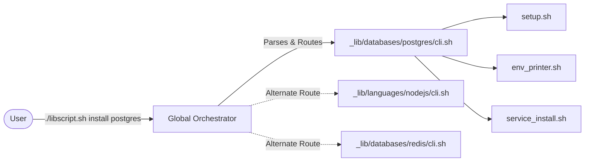
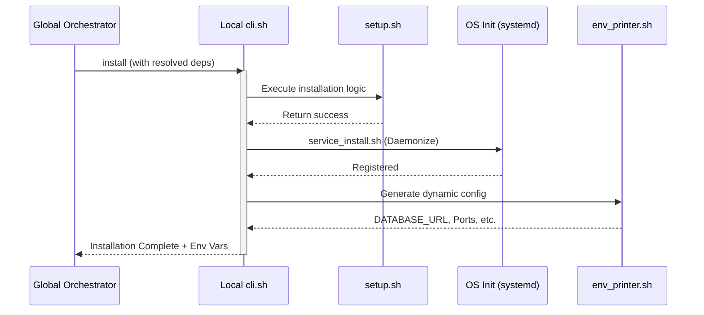
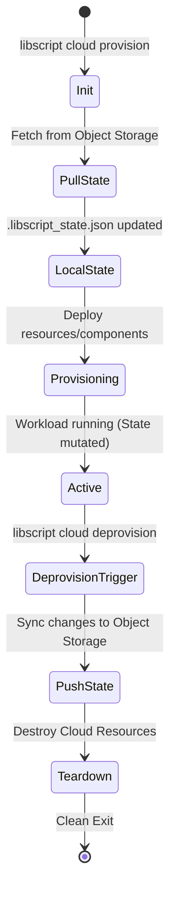

# Architecture: Decentralized & Native

LibScript is a framework for cross-platform software provisioning and packaging, built on
zero-dependency shell scripts. Its architecture follows a **Decentralized Routing** model: the
global engine routes requests to autonomous, component-specific package managers.

## 🏛️ The "Every-Thing-is-a-Package-Manager" Philosophy

Unlike monolithic configuration managers that rely on a central state and heavy runtimes, LibScript
treats every component (Postgres, Redis, Python, etc.) as a first-class, self-contained package
manager.

- **Autonomy:** Each module in `_lib/` contains its own logic for installation, service management,
  and uninstallation. They are "smart" components that understand their own lifecycle.
- **Isolation:** Components are designed to be "aware" of their own dependencies but managed
  independently, allowing for granular version control and side-by-side installations of different
  versions without global system side effects.
- **Routing Layer:** The global CLI (`libscript.sh` / `libscript.cmd`) acts as a high-speed,
  zero-dependency router. When you run `./libscript.sh install postgres`, the global engine locates
  the `postgres` module and hands off execution to its local `cli.sh`.

## 🔀 Cross-Platform Parity

A core mandate of LibScript is native execution without heavy runtimes. We achieve this through
strict parity between POSIX and Windows scripts:

- **POSIX Systems (Linux, macOS, BSD, Solaris):** Powered by `/bin/sh`. We avoid "bash-isms" to
  ensure compatibility with minimalist shells like `dash` or `ash` found in Alpine or embedded
  systems.
- **Windows Systems:** Powered by native `.cmd` (Command Prompt) and `.ps1` (PowerShell). No WSL,
  Cygwin, or MSYS2 is required for the core engine to function.
- **Unified Semantics:** Whether you are on Windows or Linux, the command structure (`install`,
  `start`, `stop`, `env`) remains identical, providing a consistent operational experience across
  the entire fleet.

## 📦 Component Anatomy & The Local CLI

Each component in `_lib/` (e.g., `_lib/databases/postgres`) is structured as a standalone manager.
The Global Orchestrator never dictates _how_ a component is installed; it only tells it _what_ to
do.

A standard component contains:

- `base_vars.schema.json` / `manifest.json`: Strictly typed metadata defining available versions,
  default ports, required system dependencies, and capabilities (e.g., "provides database").
- `cli.sh` / `cli.cmd`: The platform-specific entry points. This is the local CLI. It parses
  arguments, sets up the environment, and dispatches to the specific lifecycle scripts.
- `setup.sh` / `setup.ps1`: The "guts" of the installation logic (fetching binaries, compiling, or
  using system package managers).
- `service.sh` / `service.cmd`: Logic for interacting with the OS init system (systemd, Windows
  Services, launchd) to daemonize the component.
- `env_printer.sh` / `env_printer.cmd`: Generates dynamic environment variables (like passwords or
  connection strings) generated during installation.
- `test.sh` / `test.cmd`: Native validation scripts to prove the component is running and healthy.
- `uninstall.sh` / `uninstall.cmd`: Idempotent cleanup logic.

### The Component Lifecycle

When the global `libscript.sh` is invoked, it delegates to the component's lifecycle hooks:

1. **Resolution:** Global orchestrator resolves dependencies and locates the component directory.
2. **Setup (`install`):** Executes `setup.sh`. The component downloads payloads to the `caches/`
   directory, installs binaries to the configured `--prefix`, and templates configuration files.
3. **Daemonization (`install-service`):** Executes `service_install.sh` to register the component
   with the OS init system.
4. **Environment Generation (`env`):** Executes `env_printer.sh` to expose connection strings or
   credentials to dependent services.
5. **Execution (`start`/`stop`):** Executes `service.sh action start` to manage the running daemon.
6. **Validation (`test`/`health`):** Executes `test.sh` to verify service health.
7. **Teardown (`uninstall`):** Executes `uninstall.sh` and `service_uninstall.sh` to remove
   artifacts and daemons.

## ☸️ The Global Resolution Engine & Declarative Stacks

LibScript includes a built-in automated stack resolution engine. While individual components are
autonomous, complex applications are defined via a declarative `libscript.json` file.

The engine operates as follows:

1.  **Parse:** Reads the `libscript.json` stack definition.
2.  **Scan:** Traverses the `_lib/` directory catalog to collect component manifests.
3.  **Resolve:** Evaluates version constraints (e.g., `postgres>=16`, `python~=3.10`) and resolves
    transitive dependencies using a lightweight algorithm implemented via `jq` and shell core.
4.  **Execute:** Generates an optimized execution plan for either native installation (calling
    component `cli.sh` in the correct dependency order) or artifact generation.

## 🧠 State Management & Synchronization

LibScript relies on local execution but maintains idempotency and tracking through state files.

- **Local State (`.libscript_state.json`):** Tracks installed components, their active versions,
  dynamic environment variables, and provisioned cloud resource IDs. This acts as the source of
  truth for the local environment.
- **Multicloud State Sync:** When deploying to the cloud, LibScript supports generic bidirectional
  state synchronization backed by Object Storage (S3-compatible, GCS, Azure Blob). During a
  `provision` run, the engine can pull previous state from the bucket, and during `deprovision`, it
  can push mutated state (like SQLite DBs or let's encrypt certs) back to remote storage.

## ☁️ PaaS Orchestration Layer & Hardware Acceleration

The `cloud` component (`_lib/cloud`) provides a unified, multicloud PaaS interface. It delegates to
provider-specific modules in `_lib/cloud-providers/`, wrapping official vendor CLIs (`aws`, `az`,
`gcloud`) into a consistent, idempotent syntax. It leverages native orchestration primitives (e.g.,
Azure VNets, NSGs, and VMs, or AWS VPCs) rather than generic abstractions, ensuring maximum
performance and alignment with each provider's best practices.

**Hardware-Aware Orchestration:** The framework natively understands specialized compute resources.
Provider modules like `cloud-providers/gcp/tpu-vm` handle the specific APIs required to provision
Tensor Processing Units (TPUs) or GPUs, bridging the gap between standard cloud deployment and AI
infrastructure.

## 🛠️ The CLI & Generator Engine

The high-level CLI routing, orchestration, and generation logic reside in `cli/commands/`. This
includes:

- **`package-as` Engine:** Translates native definitions into various production artifacts:
  - **Containers:** Optimized `Dockerfile` and `docker-compose.yml` manifests.
  - **Native Installers:** MSI and EXE via InnoSetup/NSIS (Windows), DEB/RPM/APK (Linux), TXZ
    (FreeBSD), and PKG/DMG (macOS).
  - **Interactive Shell:** A `TUI` installer using `dialog`/`whiptail` to select components and
    generate targets.

## 🌐 Network & Routing (`netctl`)

_Note: `netctl` replaces the legacy `setup_ingress.sh` logic with a robust, universal proxy engine._

LibScript uses an embedded sub-component called `netctl` to provide a universal abstraction layer
for defining routes, static file maps, and proxies. `netctl` securely translates high-level ingress
requirements from `libscript.json` into native configurations for Nginx, Caddy, Apache, or IIS
without leaving any footprint behind.
