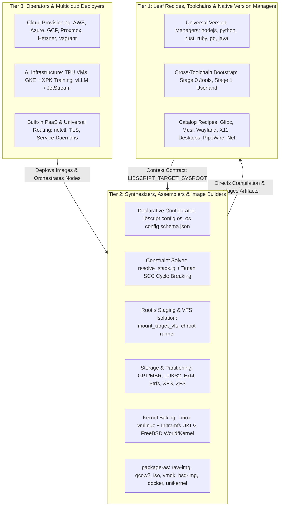
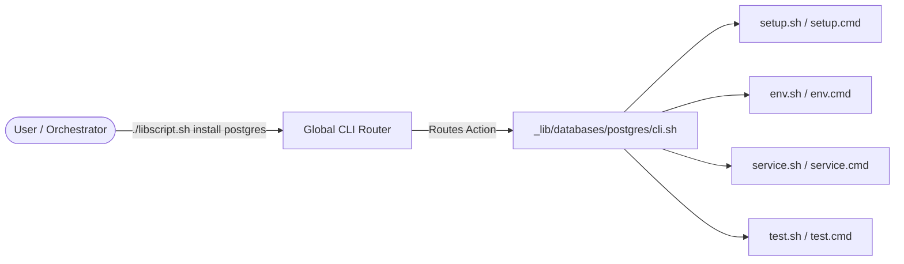
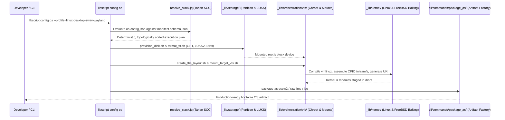
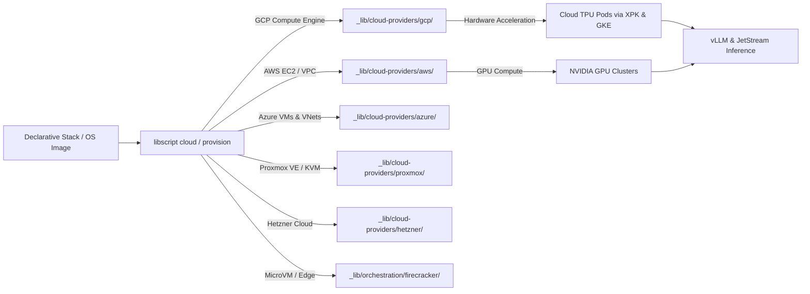
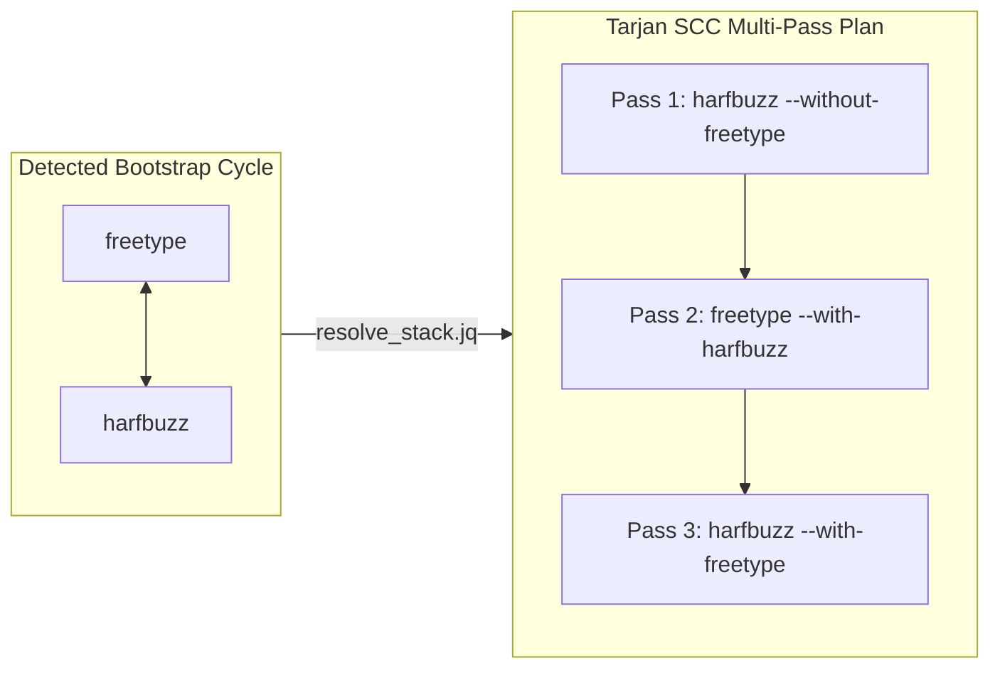

# Architecture: Decentralized, Native & Tiered

LibScript is a unified software delivery substrate and operating system synthesis framework built on
zero-dependency shell scripts. It scales from an everyday developer toolchain version manager
(natively replacing `nvm`, `pyenv`, `rustup`, and `rvm`) to a full-system operating system
synthesizer (`package-as`) and multicloud AI cluster orchestrator.

The architecture follows two foundational design patterns:

1. **Decentralized Routing**: The global CLI (`libscript.sh` / `libscript.cmd`) acts as a
   high-speed, zero-dependency router that delegates to autonomous, component-specific package
   managers in `_lib/`.
2. **Three-Tier Architectural Division of Concerns**: A strict separation of responsibilities
   between leaf recipes (Tier 1), system synthesizers and kernel image builders (Tier 2), and
   multicloud AI operators (Tier 3) to prevent combinatorial explosion, cross-layer leakage, and
   host contamination.

---

## 🏛️ The Three-Tier Architectural Division of Concerns

To prevent scope creep and ensure deterministic reproducibility, LibScript codifies strict boundary
contracts between its functional layers.



---

## 📦 Tier 1: Leaf Recipes, Cross-Toolchains & Native Version Management

Tier 1 represents the foundational substrate located in `_lib/`. Every component directory is an
autonomous package manager that knows how to acquire, compile, stage, and daemonize its own
software.

### 1. The "Every-Thing-is-a-Package-Manager" Model

Unlike monolithic configuration management tools that require massive language runtimes (Python,
Ruby, or Go) and centralized state engines, LibScript treats every component (Postgres, Nginx,
Python, Mesa, Wayland) as a first-class, standalone package manager:

- **Autonomy**: Each directory in `_lib/` contains its own CLI (`cli.sh`, `cli.cmd`), installation
  logic (`setup.sh`, `setup.cmd`), service integration (`service.sh`, `service.cmd`), and
  environment printer (`env.sh`, `env.cmd`).
- **Decoupled Execution**: Components never query other components directly. All dependency
  relationships are declared in `manifest.json` and resolved upstream by the Tier 2 solver.
- **Dual Invocation**: Any component can be executed via the global router
  (`./libscript.sh install python 3.12`) or directly via its local CLI
  (`./_lib/languages/python/cli.sh install 3.12`).



### 2. Universal Toolchain Version Management

LibScript serves as a native, zero-dependency replacement for toolchain-specific managers such as
`nvm`, `fnm`, `pyenv`, `rustup`, `rvm`, and `sdkman`.

```mermaid
sequenceDiagram
    autonumber
    actor Dev as Developer / Subshell
    participant Router as Global Router (libscript.sh)
    participant Component as Component CLI (_lib/languages/<tool>/cli.sh)
    participant Upstream as Official Upstream Release API
    participant Disk as Sandbox (${LIBSCRIPT_HOME}/<tool>/)
    participant ShellEnv as Active Shell Environment

    Dev->>Router: ./libscript.sh ls-remote <tool>
    Router->>Component: ls-remote
    Component->>Upstream: Query release tags / indexes
    Upstream-->>Dev: List of available semantic versions

    Dev->>Router: ./libscript.sh install <tool> <version>
    Router->>Component: install <version>
    Component->>Disk: Fetch payload, verify checksum, extract into <version>/
    Component->>Disk: Create / update alias symlink (e.g., lts -> <version>)

    Dev->>Router: ./libscript.sh use <tool> <version>
    Router->>Component: env <version>
    Component-->>ShellEnv: Inject ${LIBSCRIPT_HOME}/<tool>/<version>/bin into PATH
    Note over ShellEnv: Isolated to current shell; zero global profile mutation

    Dev->>Router: ./libscript.sh uninstall <tool> <version>
    Router->>Component: uninstall <version>
    Component->>Disk: Idempotently remove <version>/ directory
```

#### Architectural Contract for Version Managers

1. **Isolated Sandboxing**: Every installed version is isolated in a non-destructive directory
   structure governed by `LIBSCRIPT_HOME` (default: `~/.libscript/`):
   ```text
   ${LIBSCRIPT_HOME}/<component>/<exact_version>/
   ├── bin/
   ├── lib/
   └── share/
   ```
2. **Universal Lifecycle Verbs**: Every toolchain component strictly implements five canonical
   operations:
   - `ls-remote`: Queries official upstream APIs or release indexes without requiring third-party
     tools.
   - `install <version>`: Downloads, verifies checksums, compiles or unpacks the binary, and
     symlinks aliases (e.g., `lts`, `latest`).
   - `ls`: Inspects locally installed versions in `${LIBSCRIPT_HOME}/<component>/`.
   - `use <version>`: Prepends `${LIBSCRIPT_HOME}/<component>/<version>/bin` to the active shell
     session's `PATH` without mutating global system profiles (`/etc/profile`, `~/.bashrc`).
   - `uninstall <version>`: Idempotently cleans up the version directory.
3. **No Sudo, No Global Pollution**: Standard version operations run unprivileged, guaranteeing that
   multiple shell sessions or CI workers can run different versions concurrently on the same host.

### 3. The Standard Context Contract

When Tier 1 leaf recipes are invoked during full operating system synthesis (Tier 2), they
communicate with the orchestration layer exclusively via standard environment variables:

| Environment Variable       | Description                                                                                | Default Fallback                               |
| :------------------------- | :----------------------------------------------------------------------------------------- | :--------------------------------------------- |
| `LIBSCRIPT_TARGET_SYSROOT` | Target installation prefix (equivalent to `DESTDIR`). Recipes must install artifacts here. | `${LIBSCRIPT_ROOT_DIR}/build/target-sysroot`   |
| `LIBSCRIPT_HOST_ROOT`      | Host-side cross-toolchain prefix.                                                          | `${LIBSCRIPT_ROOT_DIR}/build/tools` (`/tools`) |
| `LIBSCRIPT_OFFLINE`        | Boolean (`0` or `1`). If `1`, recipes are strictly forbidden from making network calls.    | `0`                                            |
| `LIBSCRIPT_CACHE_DIR`      | Directory containing pre-hydrated tarballs, packages, and sources.                         | `${LIBSCRIPT_ROOT_DIR}/cache`                  |
| `LIBSCRIPT_TARGET_ARCH`    | Target processor architecture (`x86_64`, `aarch64`, `riscv64`, `i686`).                    | Auto-detected host arch                        |
| `LIBSCRIPT_TARGET_LIBC`    | Target standard C library runtime (`glibc`, `musl`, `bsd-libc`, `nolibc`).                 | `glibc`                                        |
| `LIBSCRIPT_TARGET_OS`      | Target operating system family (`linux`, `freebsd`, `unikraft`).                           | `linux`                                        |
| `LIBSCRIPT_TARGET_TRIPLET` | Standardized GNU/LLVM triplet (e.g., `x86_64-libscript-linux-gnu`).                        | Resolved via `triplets.sh`                     |

```mermaid
flowchart TD
    subgraph Tier2Orch[Tier 2 Orchestrator / Assembler]
        Plan[Execution Plan Stage]
        EnvInject[Context Contract Injection]
    end

    subgraph Context[Standard Context Contract Environment]
        SYSROOT["LIBSCRIPT_TARGET_SYSROOT<br/>(build/target-sysroot)"]
        HOSTROOT["LIBSCRIPT_HOST_ROOT<br/>(build/tools)"]
        OFFLINE["LIBSCRIPT_OFFLINE<br/>(0=Online, 1=Air-Gapped)"]
        TRIPLET["LIBSCRIPT_TARGET_TRIPLET<br/>(x86_64-libscript-linux-gnu)"]
    end

    subgraph Tier1Recipe[Tier 1 Autonomous Recipe (_lib/*/setup.sh)]
        Detect[Verify .stamp.<component>]
        Build[Compile / Extract Artifacts]
        Stage[Install Directly to LIBSCRIPT_TARGET_SYSROOT]
        Stamp[Write Atomic .stamp.<component>]
    end

    Plan --> EnvInject
    EnvInject --> Context
    Context --> Tier1Recipe
    Detect -->|Stamp Missing| Build
    Build --> Stage
    Stage --> Stamp
```

### 4. Multi-Stage Toolchain Bootstrapping

LibScript implements an automated, reproducible bootstrap sequence:

- **Stage 0 (`_lib/toolchains/bootstrap/stage0.sh`)**: Host-driven cross-toolchain compilation.
  Builds isolated cross-Binutils (Pass 1), standalone cross-GCC (Pass 1), installs target kernel API
  headers, compiles target LibC (`glibc` or `musl`), and constructs cross-GCC (Pass 2) inside
  `LIBSCRIPT_HOST_ROOT` (`/tools`).
- **Stage 1 (`_lib/toolchains/bootstrap/stage1.sh`)**: Cross-compiles a minimal standalone POSIX
  userland (`dash`, `coreutils`, `diffutils`, `gawk`, `grep`, `gzip`, `make`, `patch`, `sed`, `tar`,
  `xz`) linked exclusively against `/tools/lib/libc.so`.
- **Sanitization Invariant**: Binaries produced in Stage 1 are verified with `readelf -l` to ensure
  zero references to host linkers (e.g., `/lib64/ld-linux-x86-64.so.2`).

---

## ⚙️ Tier 2: Synthesizers, Assemblers & Kernel Image Baking

Tier 2 orchestrates Tier 1 recipes into complete, functional, bootable operating systems and virtual
appliances.



### 1. Declarative OS Configuration & TUI Engine

OS definitions are declared in JSON adhering to `os-config.schema.json`. Users can configure
instances via:

- **Interactive TUI Configurator (`cli/commands/config/config.sh`, `tui_engine.sh`)**: A portable
  ANSI VT100 / whiptail / dialog menu engine matching kernel `menuconfig`.
- **Curated Profiles (`profiles/`)**: Ready-to-build configurations covering headless minimal
  servers, full Wayland desktops (Sway, Hyprland, Plasma 6), FreeBSD ZFS appliances, and microVM
  appliances.

### 2. Isolated Rootfs & Virtual Kernel Filesystems (VFS)

Tier 2 provisions an independent filesystem root to guarantee zero host pollution:

- **FHS Layout (`create_fhs_layout.sh`)**: Establishes standard `/bin`, `/usr`, `/lib`, `/etc`,
  `/var`, `/boot`, `/dev`, `/proc`, `/sys` trees, supporting both modern merged `/usr` and legacy
  split `/usr`.
- **Idempotent VFS Lifecycle (`mount_target_vfs.sh` / `umount_target_vfs.sh`)**:
  - Checks mount points (`mountpoint -q` or `findmnt`) before mounting.
  - Mounts `devtmpfs` on `<rootfs>/dev`, `devpts` on `<rootfs>/dev/pts`, `tmpfs` on
    `<rootfs>/dev/shm`, `proc` on `<rootfs>/proc`, and `sysfs` on `<rootfs>/sys`.
  - Registers cleanup traps (`trap 'umount_target_vfs' EXIT INT TERM ERR`) to prevent mount leaks.
- **Isolated Execution Runner (`runner.sh`)**: Executes commands within Linux namespaces using
  `unshare --mount --uts --ipc --pid --fork chroot <rootfs>` with sanitized environments.

### 3. Storage, Partitioning & Disk Provisioning (`_lib/storage/`)

- **Partitioning (`provision_disk.sh`)**: Automates scripted disk formatting using `sfdisk` /
  `parted`:
  - Modern UEFI (GPT partition table with FAT32 EFI System Partition type
    `C12A7328-F81F-11D2-BA4B-00A0C93EC93B`).
  - Legacy BIOS (MBR or GPT with BIOS Boot Partition `21686148-6449-6E6F-744E-656564454649`).
  - Hybrid UEFI/BIOS.
- **LUKS2 Encryption**: Optional full-disk encryption formatted with
  `cryptsetup luksFormat --type luks2 --pbkdf argon2id` and automated `/etc/crypttab` creation.
- **Filesystem Formatting (`format_fs.sh`)**: Idempotently formats Ext4, Btrfs (including nested
  subvolume layouts: `@`, `@home`, `@snapshots`), XFS, VFAT, and ZFS zpools.

### 4. Linux & FreeBSD Kernel Baking

LibScript compiles and configures operating system kernels natively:

#### Linux Kernel Engine (`_lib/kernel/linux/`)

- Downloads and cryptographically verifies official `kernel.org` sources or tracks specific git
  branches.
- Integrates modular configuration snippets via `merge_config.sh`:
  - `virtio.cfg`: Virtualized guest acceleration (`CONFIG_VIRTIO`, `CONFIG_VIRTIO_BLK`,
    `CONFIG_VIRTIO_NET`).
  - `wayland_drm.cfg`: Direct Rendering Manager (`CONFIG_DRM`, AMDGPU, Intel i915/Xe).
  - `sound.cfg`: Kernel ALSA audio subsystems.
  - `zfs.cfg` & `containers.cfg`: OverlayFS, cgroups, namespaces.
- Idempotently builds `bzImage`, modules, and device tree blobs (`dtbs`), installing them alongside
  `System.map` into `<target-rootfs>/boot/` and executing `depmod`.

#### Initramfs Generation Subsystem (`_lib/kernel/initramfs/gen_initramfs.sh`)

- Synthesizes a minimal CPIO archive containing static BusyBox/Toybox binaries, necessary device
  nodes (`/dev/console`, `/dev/null`), and essential storage/crypto kernel modules (`nvme`,
  `virtio_blk`, `dm-crypt`, `ext4`, `btrfs`).
- Injects a resilient POSIX `/init` script that parses `/proc/cmdline` for `root=UUID=...` or
  `root=PARTUUID=...`, handles LUKS password prompts or keyfiles via `cryptsetup open`, mounts the
  real root at `/newroot`, and executes `switch_root`.

#### FreeBSD Kernel & World Subsystem (`_lib/freebsd/`)

- Manages native FreeBSD source trees, generating optimized `/etc/make.conf` and `/etc/src.conf`
  knobs.
- Orchestrates `make buildworld` and `make buildkernel KERNCONF=...` with isolated
  `MAKEOBJDIRPREFIX` boundaries.
- Executes `installworld` and `distribution` to populate target sysroots, generating
  `/boot/loader.conf` and `/etc/rc.conf` for ZFS-on-root booting.

#### Bootloaders & Unified Kernel Images (UKI)

- Installs GRUB2 (EFI and BIOS), `systemd-boot`, or Limine.
- Generates UEFI Unified Kernel Images (UKI): single signed `.efi` binaries combining the Linux
  kernel stub, initramfs, OS release, and kernel command line.

### 5. Universal Artifact Packaging (`package-as`)

The `package-as` engine (`cli/commands/package_as/`) transforms synthesized environments into
distributable deployment formats:

- **`raw-img`**: Partitioned raw disk images (`.img`) ready for physical drive flashing (`dd`).
- **`qcow2` / `vmdk` / `vdi`**: Compressed virtual machine disk images for QEMU/KVM, VMware ESXi,
  and VirtualBox.
- **`iso`**: Bootable hybrid live ISO media with SquashFS compression and copy-on-write OverlayFS
  RAM persistence.
- **`rootfs-tar` / `docker`**: Clean archive tarballs ready for OCI image ingestion
  (`docker import`) or container/jail roots.
- **`bsd-img`**: Bootable FreeBSD images formatted with UFS or ZFS for bhyve hypervisors or bare
  metal.
- **`unikernel`**: Direct-kernel boot images (`vmlinux` / `unikraft.bin`) optimized for Firecracker
  and Cloud-Hypervisor microVMs.
- **Native Installers**: Automated `.msi` (WiX), `.exe` (InnoSetup/NSIS), `.deb`, `.rpm`, `.apk`,
  and `.pkg` builders.

---

## 🌐 Tier 3: Operators, Multicloud & AI Cluster Deployment

Tier 3 acts as the operational control plane, deploying images and stacks across public clouds,
on-prem hypervisors, and distributed AI accelerators.



### 1. Multicloud Lifecycle Operators (`_lib/cloud-providers/`)

LibScript avoids vendor lock-in by providing a unified, idempotent operational grammar (`provision`,
`deprovision`, `cloud <provider> <resource>`):

- Wraps native cloud CLIs (`aws`, `az`, `gcloud`, `hcloud`, `pvesh`), securely leveraging the
  operator's local credentials (`~/.aws/credentials`, `gcloud auth`).
- Manages complete lifecycle for virtual machines, VPCs, subnets, firewalls, and block storage
  across AWS, Azure, GCP, Proxmox VE, Hetzner, and Vagrant.

### 2. Distributed AI & Hardware Acceleration

LibScript integrates directly with AI accelerators:

- **TPU VM Provisioning**: Provisions single-node and multi-node Google Cloud TPUs, auto-mounting
  [GCS FUSE](https://cloud.google.com/storage/docs/gcs-fuse) for fast dataset streaming and wiring
  [TensorBoard](https://www.tensorflow.org/tensorboard) telemetry.
- **Large-Scale Training via XPK & GKE**: Seamless integration with Google's Accelerated Processing
  Kit ([`xpk`](https://github.com/google/xpk)) to schedule and monitor distributed training
  workloads across massive TPU Pod slices (`v4-128`, `v5p-2048`).
- **Accelerated Inference Serving**: Automated deployment blueprints for:
  - [`vLLM`](https://github.com/vllm-project/vllm): High-throughput PagedAttention LLM inference.
  - [`JetStream`](https://github.com/google/JetStream): Memory-optimized inference server for Google
    TPUs.
  - [`Ollama`](https://ollama.com/): Standalone local LLM orchestration.

### 3. Built-in PaaS & Universal Routing (`netctl`)

`netctl` provides an ingress, routing, and reverse proxy abstraction layer that turns raw
infrastructure into a managed PaaS:

- **Configuration Emission**: Translates high-level declarative route maps into native
  configurations for Nginx, Caddy, Apache, or Windows IIS.
- **Automated TLS**: Direct integration with Let's Encrypt / Certbot for automatic certificate
  acquisition and renewal.
- **Service Daemonization**: Automatically templates and registers application service supervisors
  for `systemd` (Linux), `launchd` (macOS), or Windows Service Control Manager.

---

## 🧮 Declarative Constraint Solver & Tarjan SCC Algorithm

LibScript incorporates a pure POSIX + `jq` dependency and constraint solver
(`_lib/orchestration/resolve_stack.jq`, `resolve_stack.sh`):

### 1. Extended Manifest Schema (`manifest.schema.json`)

Components declare fine-grained capabilities:

- **USE Variants (`variants`)**: Feature flags (e.g., `wayland`, `x11`, `pipewire`, `lto`, `static`)
  that conditionally inject compilation flags (`configure_args`, `meson_args`, `cmake_args`,
  `cflags`, `ldflags`).
- **Dependency Classification**:
  - `host_tools`: Tools required on the build host (e.g., `bison`, `meson`, `ninja`).
  - `build_deps`: Headers and libraries required in `LIBSCRIPT_TARGET_SYSROOT`.
  - `runtime_deps`: Daemons and programs required in the target rootfs at runtime.
  - `tier`: Criticality tier (`required`, `recommended`, `optional`).

### 2. Tarjan's Strongly Connected Components (SCC) Cycle Breaking

Complex software distributions frequently contain bootstrap dependency cycles (e.g., `freetype`
$\leftrightarrow$ `harfbuzz`, `glib` $\leftrightarrow$ `gobject-introspection`, `curl`
$\leftrightarrow$ `openssl` $\leftrightarrow$ `libssh2`).

The solver executes Tarjan's SCC algorithm within `jq`:

1. Identifies cycles by locating strongly connected components with greater than one node.
2. Emits a multi-pass staged execution plan:
   - **Pass 1**: Compiles Package A with bootstrap flags (disabling optional cyclic dependencies).
   - **Pass 2**: Compiles Package B linked against bootstrap Package A.
   - **Pass 3**: Recompiles Package A fully linked against Package B.



---

## 🔒 Cross-Platform Standards & Quality Invariants

LibScript enforces strict engineering invariants across all scripts and automation harnesses:

### 1. POSIX Compliance & The Canonical `THIS_FILE=` Dance

All `.sh` scripts enforce pure `#!/bin/sh` without bashisms. To ensure robust relative path
resolution regardless of how a script is invoked (sourced, subshell, symlinked), every shell script
contains the canonical preamble:

```sh
set -feu
if [ "${SCRIPT_NAME-}" ]; then
  THIS_FILE="${SCRIPT_NAME}"
elif [ "${BASH_SOURCE-}" ]; then
  THIS_FILE="${BASH_SOURCE}"
else
  THIS_FILE="${0}"
fi

case "${STACK+x}" in
  *':'"${THIS_FILE}"':'*)
    printf '[STOP]     processing "%s"
' "${THIS_FILE}" >&2
    if (return 0 2>/dev/null); then return; else exit 0; fi ;;
  *) printf '[CONTINUE] processing "%s"
' "${THIS_FILE}" >&2 ;;
esac
export STACK="${STACK:-}${THIS_FILE}"':'
SCRIPT_DIR=$(cd -- "$(dirname -- "${THIS_FILE}")" && pwd)
: "${LIBSCRIPT_ROOT_DIR:=$(d="$SCRIPT_DIR"; while [ ! -f "$d/libscript.sh" ]; do n="${d%/*}"; [ -z "$n" ] && n="/"; [ "$d" = "$n" ] && break; d="$n"; done; printf '%s
' "$d")}"
export LIBSCRIPT_ROOT_DIR
```

### 2. Windows Batch (`.cmd`) Parity & Recursion Guards

Every shell script has an exact `.cmd` companion implementing delayed expansion and matching
recursion guards:

```cmd
@echo off
setlocal EnableDelayedExpansion
set "THIS_FILE=%~f0"

SET "searchVal=;%THIS_FILE%;"
IF NOT DEFINED STACK (
    SET "STACK=;%THIS_FILE%;"
    echo [CONTINUE] processing "%THIS_FILE%"
) ELSE (
    IF NOT "!STACK:%searchVal%=!"=="!STACK!" (
        echo [STOP]     processing "%THIS_FILE%"
        SET ERRORLEVEL=0
        goto end
    ) ELSE (
        SET "STACK=!STACK!%THIS_FILE%;"
        echo [CONTINUE] processing "%THIS_FILE%"
    )
)
```

### 3. Option A Win32 Hard-Fail Boundary Proforma

Operating system image assembly inherently relies on Linux kernel primitives (`unshare`, `mount`,
`losetup`, `mknod`). Windows CMD and PowerShell scripts must **never** attempt fake emulation of
these primitives.

Instead, they adhere to the **Option A Proforma**:

- Standardize on **exit code `86`** (`EX_UNAVAILABLE` / `ENOSYS`), terminating native execution
  immediately.
- Explicitly output instructions redirecting the developer to the containerized/VM builder
  (`vm_builder.cmd` or `package-as docker`).

### 4. Idempotency & The 2x Execution Test

All scripts must be strictly idempotent:

- Directories are created exclusively via `mkdir -p` (POSIX) or `if not exist "<dir>" mkdir "<dir>"`
  (Windows).
- Symlinks use `ln -sf`.
- Synthesis steps write atomic `.stamp.<name>` files.
- The repository enforces a 2x consecutive execution verification test
  (`tests/test_idempotency_matrix.sh`): running any synthesis pipeline twice consecutively on an
  identical workspace must result in zero state mutation and exit code 0.

### 5. Documentation & Git Safety Invariants

- **100% Documentation Coverage**: Every script contains structured `## Overview` and `## Usage`
  headers in its first 30 lines.
- **Git Safety Invariant**: Automated test suites, CI runners, and build harnesses are strictly
  forbidden from executing `git push`.
