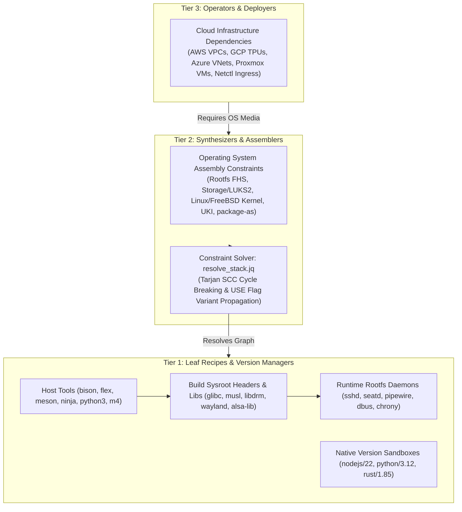
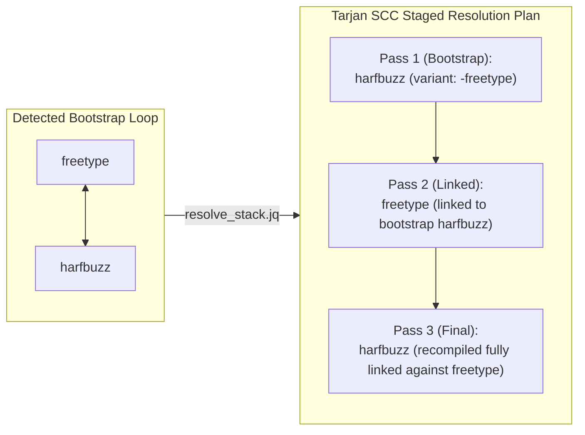
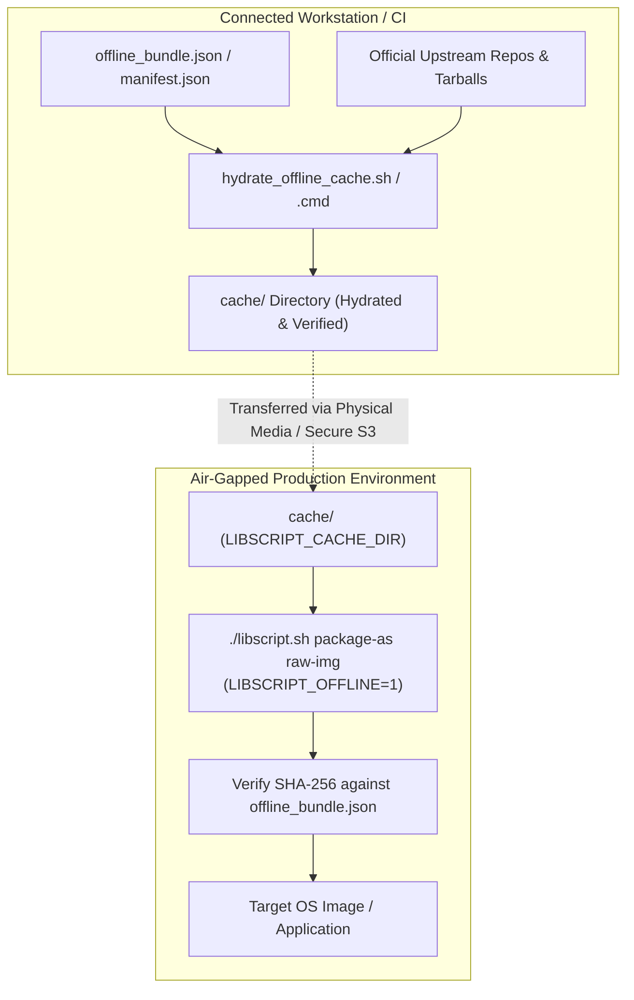

# Dependency Management & Constraint Resolution

LibScript employs a deterministic, multi-tier dependency management and constraint resolution
architecture. From isolating multiple versions of developer runtimes (Node.js, Python, Rust) without
third-party managers to compiling full operating system distributions without cyclic deadlocks,
LibScript enforces strict reproducibility, air-gapped isolation, and cross-platform parity.

---

## 🏛️ Dependency Topology & The Three-Tier Model

Dependencies in LibScript are classified across three distinct operational tiers to prevent scope
creep, cross-layer leakage, and host contamination:



---

## 📦 The Component Manifest Contract (`manifest.schema.json`)

Every autonomous component in `_lib/` declares its identity, interfaces, capabilities, and
dependencies via a strictly typed `manifest.json` conforming to `_lib/_common/manifest.schema.json`.

### 1. Dependency Classification & Criticality Tiers

Unlike traditional package managers that conflate compilation and execution requirements, LibScript
strictly delineates dependencies by build lifecycle phase:

```json
{
  "name": "wayland",
  "category": "display-servers",
  "version": "1.23.0",
  "dependencies": {
    "host_tools": ["meson", "ninja", "pkg-config", "wayland-scanner"],
    "build_deps": ["libffi", "expat", "libxml2"],
    "runtime_deps": ["libffi", "expat"],
    "tier": "required"
  }
}
```

- **`host_tools`**: Binaries executed on the compilation host machine during bootstrap and building
  (e.g., `bison`, `flex`, `m4`, `meson`, `ninja`, `pkg-config`).
- **`build_deps`**: C/C++ headers and static/shared libraries required inside the isolated sysroot
  (`LIBSCRIPT_TARGET_SYSROOT`) during compilation.
- **`runtime_deps`**: Executables, dynamic shared objects, and background daemons required inside
  the target rootfs at runtime.
- **`tier`**: Criticality level during dependency graph traversal:
  - `required`: Hard dependency; resolution failure aborts the build.
  - `recommended`: Automatically included in standard desktop and server stacks.
  - `optional`: Only compiled when explicitly enabled via configuration or feature flags.

### 2. Standardized USE Flag Variants (`variants`)

LibScript incorporates a feature variant system (inspired by Gentoo USE flags and BLFS conditional
options) allowing components to be built with fine-grained modular features:

```json
{
  "name": "mesa",
  "variants": {
    "wayland": {
      "description": "Enables Wayland EGL platform and DRM integration",
      "default_enabled": true,
      "build_args": {
        "meson_args": ["-Dplatforms=wayland,x11", "-Dwayland=enabled"]
      },
      "requires_variants": ["wayland[egl]"],
      "conflicts_variants": ["headless"]
    },
    "vulkan": {
      "description": "Enables Vulkan drivers (radv, anv, lavapipe)",
      "default_enabled": true,
      "build_args": {
        "meson_args": ["-Dvulkan-drivers=amd,intel,swrast"]
      }
    }
  }
}
```

- **`build_args`**: Injects structured flags across build systems (`configure_args`, `meson_args`,
  `cmake_args`, `cflags`, `ldflags`).
- **`requires_variants`**: Enforces inter-package or intra-package variant dependencies (e.g.,
  enabling `wayland` on GTK4 requires `wayland` on Mesa).
- **`conflicts_variants`**: Identifies mutually exclusive configurations (e.g., `static` vs.
  `shared`, or `wayland` vs. `headless`).

### 3. Target Platform Compatibility Filters

Components define platform and architecture whitelists/blacklists:

```json
{
  "os_whitelist": ["linux", "freebsd"],
  "os_blacklist": ["windows"],
  "arch_whitelist": ["x86_64", "aarch64", "riscv64"],
  "arch_blacklist": ["i686"]
}
```

---

## 🧮 Automated Constraint Solving & Cycle Resolution (`resolve_stack.jq`)

Dependency resolution is performed by `_lib/orchestration/resolve_stack.jq`, executed via
cross-platform wrappers `resolve_stack.sh` (POSIX `/bin/sh`) and `resolve_stack.cmd` (Windows
Batch).

### 1. Resolution Workflow

1. **Input Ingestion**: Ingests requested stack manifests (`libscript.json`) or operating system
   configurations (`os-config.json`).
2. **Catalog Crawling**: Scans all `manifest.json` files in `_lib/` across categories
   (`base-system`, `toolchains`, `graphics`, `desktops`, etc.).
3. **Graph Construction**: Constructs an adjacency list representing all required and recommended
   dependencies.
4. **Variant Propagation**: Evaluates global configuration (e.g., `display_server: wayland`) and
   propagates the `wayland` variant across all graph nodes (Mesa, GTK, Qt, PipeWire, SDL2).
5. **Topological Ordering**: Emits an ordered execution plan (`execution-plan.schema.json`).

### 2. Tarjan's Strongly Connected Components (SCC) Cycle Breaking

Real-world software distributions contain bootstrap circular dependencies:

- **`freetype` $\leftrightarrow$ `harfbuzz`**: HarfBuzz requires FreeType for font glyph rendering;
  FreeType requires HarfBuzz for advanced OpenType layout.
- **`glib` $\leftrightarrow$ `gobject-introspection`**: GObject-Introspection compiles typelibs
  using GLib; GLib builds annotations using GObject-Introspection.
- **`curl` $\leftrightarrow$ `libssh2` $\leftrightarrow$ `openssl`**: Cyclic security transport
  dependencies.

`resolve_stack.jq` implements Tarjan's Strongly Connected Components (SCC) algorithm to detect
cycles and automatically generate multi-pass bootstrap stages:



When an SCC cycle is identified:

1. The solver isolates the cycle and generates an intermediate bootstrap stage.
2. Package A is compiled in bootstrap mode (stripping the cyclic dependency).
3. Package B is compiled against bootstrap Package A.
4. Package A is recompiled fully linked against Package B.
5. The build seamlessly continues to subsequent linear dependencies.

---

## 🌐 The Standard Context Contract

When Tier 1 leaf recipes are invoked during synthesis, they operate under the standard Context
Contract. They must consume inputs and install outputs strictly through these environment variables:

| Variable                   | Type    | Purpose                                                                                                            | Standard Example                             |
| :------------------------- | :------ | :----------------------------------------------------------------------------------------------------------------- | :------------------------------------------- |
| `LIBSCRIPT_TARGET_SYSROOT` | Path    | Staging directory where all compiled headers, libraries, and binaries must be installed (equivalent to `DESTDIR`). | `${LIBSCRIPT_ROOT_DIR}/build/target-sysroot` |
| `LIBSCRIPT_HOST_ROOT`      | Path    | Prefix hosting cross-compilers, assemblers, and host build tools (`/tools`).                                       | `${LIBSCRIPT_ROOT_DIR}/build/tools`          |
| `LIBSCRIPT_OFFLINE`        | Boolean | If `1`, network calls are prohibited. Recipes must use the local cache.                                            | `0`                                          |
| `LIBSCRIPT_CACHE_DIR`      | Path    | Directory containing cached tarballs, source repos, and packages.                                                  | `${LIBSCRIPT_ROOT_DIR}/cache`                |
| `LIBSCRIPT_TARGET_ARCH`    | String  | Target processor instruction set architecture.                                                                     | `x86_64`, `aarch64`, `riscv64`               |
| `LIBSCRIPT_TARGET_LIBC`    | String  | Target C standard library implementation.                                                                          | `glibc`, `musl`, `bsd-libc`                  |
| `LIBSCRIPT_TARGET_OS`      | String  | Target kernel and OS family.                                                                                       | `linux`, `freebsd`, `unikraft`               |
| `LIBSCRIPT_TARGET_TRIPLET` | String  | Resolved target toolchain architecture triplet.                                                                    | `x86_64-libscript-linux-gnu`                 |

### Architecture Triplet Resolution (`_lib/toolchains/triplets.sh`)

Standard triplets are calculated dynamically:

- `x86_64` + `glibc` + `linux` $\rightarrow$ `x86_64-libscript-linux-gnu`
- `x86_64` + `musl` + `linux` $\rightarrow$ `x86_64-libscript-linux-musl`
- `aarch64` + `glibc` + `linux` $\rightarrow$ `aarch64-libscript-linux-gnu`
- `aarch64` + `musl` + `linux` $\rightarrow$ `aarch64-libscript-linux-musl`
- `riscv64` + `glibc` + `linux` $\rightarrow$ `riscv64-libscript-linux-gnu`
- `x86_64` + `bsd-libc` + `freebsd` $\rightarrow$ `x86_64-unknown-freebsd14.0`

---

## 🔒 Offline & Air-Gapped Modality

In mission-critical, enterprise, or air-gapped zones, external network access is blocked. LibScript
supports dual-modality execution:



1. **Ahead-of-Time (AoT) Hydration**: Run `hydrate_offline_cache.sh` (or `.cmd` / `.ps1`) in a
   connected environment. It queries all dependencies, downloads official sources/tarballs, and
   stages them in `cache/`.
2. **Cryptographic Checksum Verification**: Every downloaded artifact is validated against
   cryptographic SHA-256 hashes defined in `offline_bundle.json`.
3. **Strict Network Inhibition**: When `LIBSCRIPT_OFFLINE=1` is exported:
   - Recipes fail immediately if any command attempts to access external networks (`curl`, `wget`,
     `git clone`, `pip install`).
   - All sources are read exclusively from `${LIBSCRIPT_CACHE_DIR}`.

---

## ⚡ Native Version Manager Dependency Isolation

For developer toolchains managed at Tier 1 (Node.js, Python, Rust, Ruby, Go, Java):

1. **Non-Destructive Coexistence**: Multiple versions of the same tool coexist under
   `${LIBSCRIPT_HOME}/<tool>/<version>`.
2. **Session-Scoped Activation**: Running `./libscript.sh use <tool> <version>` prepends the version
   path to the active subshell's `PATH`. No global environment or shell profile (`~/.bashrc`,
   `/etc/profile`) is mutated.
3. **Zero Inter-Tool Conflicts**: Python 3.10 and Python 3.12, or Node 20 and Node 22, can run
   concurrently in adjacent terminal windows on the same host without collisions.
