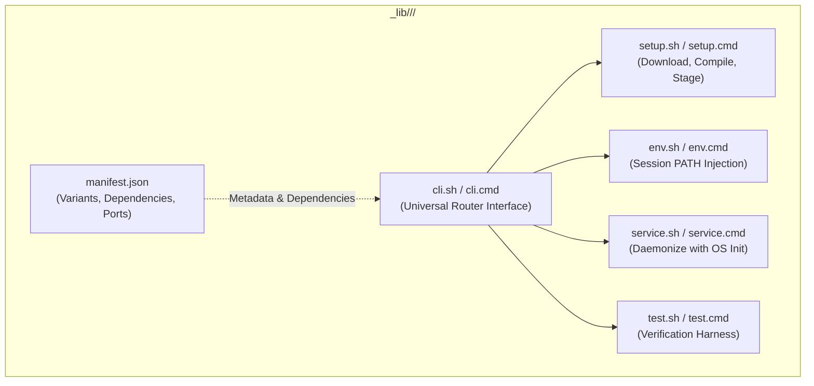

# Developing LibScript: Developer & Contributor Guide

LibScript is a high-performance, decentralized software delivery substrate and operating system
synthesis framework built on zero-dependency shell scripts. Whether you are adding a new toolchain
version manager, creating a desktop recipe, or writing a multicloud operator, your code must adhere
to strict architectural boundaries, dual-platform parity, and rigorous engineering invariants.

---

## 🏛️ The Decentralized Component Architecture

Every component in LibScript is an autonomous, self-contained package manager residing in `_lib/`
under its relevant functional category (e.g., `_lib/languages/`, `_lib/databases/`,
`_lib/base-system/`, `_lib/graphics/`, `_lib/networking/`).

### Standard Component Directory Layout

When creating or modifying a component in `_lib/<category>/<component>/`, provide the following
standard files:

```text
_lib/<category>/<component>/
├── manifest.json            # Strictly typed metadata (manifest.schema.json)
├── cli.sh                   # POSIX entry point implementing standard verbs
├── cli.cmd                  # Windows batch entry point with matching verbs
├── setup.sh                 # POSIX installation and build logic
├── setup.cmd                # Windows batch installation logic
├── service.sh               # POSIX daemon management (systemd, launchd)
├── service.cmd              # Windows service management (sc.exe, PowerShell)
├── env.sh                   # POSIX environment activation (PATH injection)
├── env.cmd                  # Windows environment activation (PATH injection)
├── test.sh                  # POSIX health and smoke test script
└── test.cmd                 # Windows health and smoke test script
```



---

## ⚡ The Native Version Manager Standard

If your component is a language runtime or developer tool (like Node.js, Python, Rust, Ruby, Go,
Java), it must adhere to the **Native Version Manager Specification**
([WHAT_A_VERSION_MANAGER_SHOULD_LOOK_LIKE.md](WHAT_A_VERSION_MANAGER_SHOULD_LOOK_LIKE.md)).

### 1. Isolated Directory Pattern

All installations must be isolated inside `${LIBSCRIPT_HOME}/<component>/<exact_version>` (default
`LIBSCRIPT_HOME`: `~/.libscript`):

```text
~/.libscript/python/3.12.3/bin/python
~/.libscript/nodejs/22.14.0/bin/node
~/.libscript/rust/1.85.0/bin/rustc
```

### 2. Mandatory Lifecycle Verbs

Every toolchain component's `cli.sh` and `cli.cmd` must implement:

- **`ls-remote`**: Queries the official upstream release index or API and prints available versions.
- **`install <version>`**:
  - Checks if `${LIBSCRIPT_HOME}/<component>/<version>` already exists (idempotent early-exit).
  - Downloads and verifies checksums.
  - Compiles or extracts artifacts into the exact version directory.
  - Updates symlink aliases (e.g., `lts` $\rightarrow$ `22.14.0`).
- **`ls`**: Lists installed versions in `${LIBSCRIPT_HOME}/<component>/`.
- **`use <version>`**: Emits shell instructions or prepends
  `${LIBSCRIPT_HOME}/<component>/<version>/bin` to the active shell's `PATH`. Never modify global
  profiles (`~/.bashrc`, `/etc/profile`).
- **`uninstall <version>`**: Removes the isolated version folder.

```mermaid
sequenceDiagram
    autonumber
    actor Dev as Developer / CLI
    participant CLI as _lib/languages/<tool>/cli.sh
    participant Cache as cache/ (LIBSCRIPT_CACHE_DIR)
    participant Target as ~/.libscript/<tool>/<version>/
    participant Shell as Active Shell Session

    Dev->>CLI: ls-remote
    CLI-->>Dev: Print upstream versions (semantic sort)
    Dev->>CLI: install 1.2.3
    CLI->>Cache: Fetch & verify payload
    CLI->>Target: Unpack / compile into isolated sandbox
    Dev->>CLI: use 1.2.3
    CLI-->>Shell: Prepend ~/.libscript/<tool>/1.2.3/bin to PATH
    Note over Shell: Isolated to subshell; zero global side-effects
```

---

## 🌐 The Context Contract for Synthesis Recipes

When Tier 1 leaf recipes are invoked during full operating system synthesis (Tier 2), they must
respect the Standard Context Contract:

1. **Install Destination**: Install all headers, libraries, and binaries strictly into
   `${LIBSCRIPT_TARGET_SYSROOT}` (never directly into `/usr` or `/usr/local` on the host).
2. **Toolchain Prefix**: Use host build tools from `${LIBSCRIPT_HOST_ROOT}` (`/tools`).
3. **Air-Gapped Modality**: Check `LIBSCRIPT_OFFLINE`. If set to `1`, do not initiate network calls;
   read exclusively from `${LIBSCRIPT_CACHE_DIR}`.
4. **Target Triplet**: Consume `${LIBSCRIPT_TARGET_TRIPLET}` (e.g., `x86_64-libscript-linux-gnu`)
   for cross-compilation flags (`--host=`, `--target=`).

---

## 🔒 Mandatory Engineering Invariants & Coding Standards

Every script submitted to LibScript must adhere to these eight non-negotiable invariants:

### 1. Strict POSIX `/bin/sh` Compliance

All `.sh` scripts must use the `#!/bin/sh` shebang on line 1.

- **Banned Bashisms**: Never use `[[ ... ]]` (use `[ ... ]`), `function foo()` (use `foo()`),
  `source` (use `.`), `type` (use `command -v`), `echo -e` (use `printf`), or arrays.
- **Error Trapping**: Always declare `set -feu` immediately after the header.

### 2. Canonical `THIS_FILE=` Dance & `STACK` Guard

Within the first 65 lines of every `.sh` script, implement canonical path resolution and recursion
protection:

```sh
set -feu
if [ "${SCRIPT_NAME-}" ]; then
  THIS_FILE="${SCRIPT_NAME}"
elif [ "${BASH_SOURCE-}" ]; then
  THIS_FILE="${BASH_SOURCE}"
else
  THIS_FILE="${0}"
fi

case "${STACK+x}" in
  *':'"${THIS_FILE}"':'*)
    printf '[STOP]     processing "%s"
' "${THIS_FILE}" >&2
    if (return 0 2>/dev/null); then return; else exit 0; fi ;;
  *) printf '[CONTINUE] processing "%s"
' "${THIS_FILE}" >&2 ;;
esac
export STACK="${STACK:-}${THIS_FILE}"':'
SCRIPT_DIR=$(cd -- "$(dirname -- "${THIS_FILE}")" && pwd)
: "${LIBSCRIPT_ROOT_DIR:=$(d="$SCRIPT_DIR"; while [ ! -f "$d/libscript.sh" ]; do n="${d%/*}"; [ -z "$n" ] && n="/"; [ "$d" = "$n" ] && break; d="$n"; done; printf '%s
' "$d")}"
export LIBSCRIPT_ROOT_DIR
```

### 3. Exact Windows Batch (`.cmd`) Parity

Every `.sh` script must have an identical paired `.cmd` companion. Batch scripts must enable delayed
expansion and implement matching recursion guards within their first 25 lines:

```cmd
@echo off
setlocal EnableDelayedExpansion
set "THIS_FILE=%~f0"

SET "searchVal=;%THIS_FILE%;"
IF NOT DEFINED STACK (
    SET "STACK=;%THIS_FILE%;"
    echo [CONTINUE] processing "%THIS_FILE%"
) ELSE (
    IF NOT "!STACK:%searchVal%=!"=="!STACK!" (
        echo [STOP]     processing "%THIS_FILE%"
        SET ERRORLEVEL=0
        goto end
    ) ELSE (
        SET "STACK=!STACK!%THIS_FILE%;"
        echo [CONTINUE] processing "%THIS_FILE%"
    )
)
```

### 4. Option A Win32 Hard-Fail Boundary Proforma

Operating system image assembly inherently relies on Linux kernel primitives (`unshare`, `mount`,
`losetup`, `mknod`). Companion `.cmd` and `.ps1` scripts must **never** attempt fake Win32
emulation.

When encountering Linux kernel boundaries on Windows:

- Immediately halt execution with **exit code `86`** (`EX_UNAVAILABLE` / `ENOSYS`).
- Output guidance redirecting the user to `vm_builder.cmd` or containerized builders.

```cmd
:: Option A Win32 Proforma Example
echo [ERROR] Native Linux kernel assembly (mount/unshare) is unavailable on Win32. >&2
echo [ERROR] Please execute via container or VM builder: vm_builder.cmd >&2
exit /b 86
```

### 5. 100% Documentation Coverage

Every `.sh`, `.cmd`, `.bat`, and `.ps1` script must contain structured documentation headers within
its first 30 lines:

- `## Overview`: Concise explanation of purpose and role.
- `## Usage`: Invocation examples and flag documentation.

```sh
#!/bin/sh
# ## Overview
# Brief single-sentence explanation of what this script accomplishes.
# Complies with standard LibScript Context Contract and stamp idempotency.
#
# ## Usage
# Run `setup.sh [action]` (default action: install/compile).
```

### 6. Universal Idempotency & State Stamps

Scripts must pass the **2x Run Test**: running twice consecutively must produce zero errors and zero
mutated diffs.

- Always use `mkdir -p` (POSIX) or `if not exist "<dir>" mkdir "<dir>"` (Windows).
- Symlinks must always use `ln -sf`.
- Mark completion with atomic `.stamp.<name>` files:
  ```sh
  STAMP_FILE="${STAMPS_DIR}/.stamp.my_component"
  if [ -f "$STAMP_FILE" ]; then
    printf '[SKIP]  my_component already installed (%s)
  ```

' "$STAMP_FILE" exit 0 fi

# ... perform build ...

date -u +"%Y-%m-%dT%H:%M:%SZ" > "${STAMP_FILE}.tmp"
  mv "${STAMP_FILE}.tmp" "$STAMP_FILE"

````

### 7. Absolute Ban on Dynamic Eval
Dynamic string evaluation (`eval` in POSIX, `Invoke-Expression` / `iex` in PowerShell) is strictly prohibited. It introduces security vulnerabilities and code obfuscation.

### 8. Git Safety Invariant
Under no circumstances should any build script, test runner, CI job, or subagent invoke **`git push`**.

---

## 🧪 Verification & Audit Matrix

Before submitting changes, execute the repository's automated compliance and audit suites:

```sh
# 1. Audit all modified scripts against engineering standards
./devtools/audit/audit_standards.sh <path_to_script>

# 2. Run the 2x consecutive idempotency verification test
./tests/test_idempotency_matrix.sh

# 3. Verify headless QEMU boot test for synthesized OS images
./tests/os_boot_test.sh build/disk.qcow2 60

# 4. Verify graphical desktop Wayland/PipeWire smoke tests
./tests/os_gui_smoke_test.sh build/disk.qcow2

# 5. Verify air-gapped offline installation modality
./tests/test_airgap_boot.sh
````
