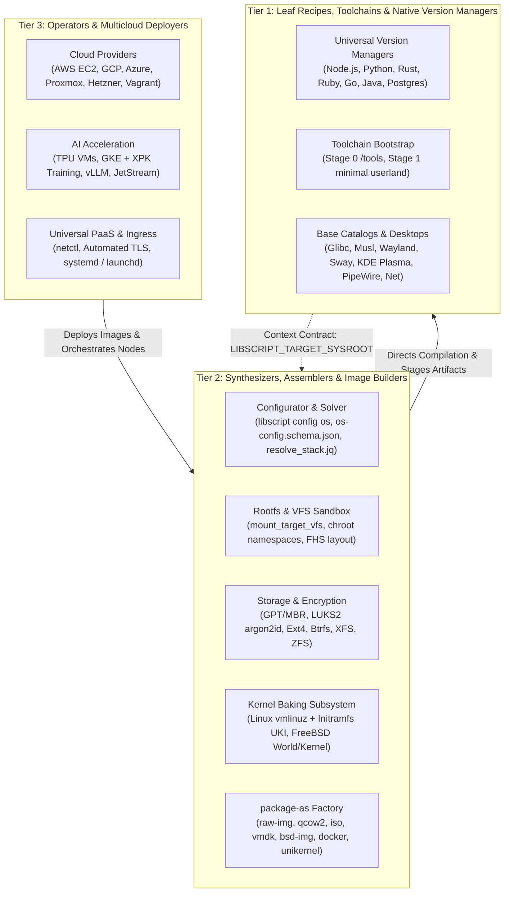
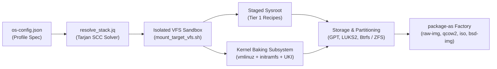
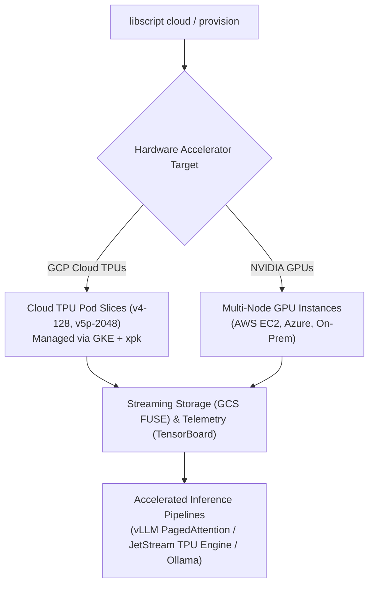

# 🚀 LibScript: The Universal Substrate & Multi-Tier OS Engine

**From Native Version Manager to Operating System Synthesizer and Multicloud AI Orchestrator.**  
_Native Power. Zero Dependencies. Zero YAML Bloat. Provision Anything, Anywhere._

[](https://opensource.org/licenses/Apache-2.0)
[](https://github.com/SamuelMarks/libscript/actions/workflows/ci.yml)

LibScript is a unified software delivery substrate written in pure, zero-dependency POSIX shell
(`/bin/sh`) and native Windows Batch (`.cmd`) / PowerShell (`.ps1`). It bridges the gap between
everyday developer toolchain management and full-system operating system engineering.

Whether you need a lightweight, universal replacement for `nvm`, `pyenv`, `rustup`, and `rvm`, an
automated pipeline to compile and bake customized Linux and FreeBSD kernels into bootable images
(`package-as`), or a multicloud operator to orchestrate distributed TPU training clusters and
inference engines, LibScript handles the entire lifecycle through a single, idempotent interface.

---

## 🌟 The Core Experience: Native Version Management

Before building operating systems or provisioning cloud fleets, developers need clean, isolated,
multi-version runtime environments without installing dozens of separate, conflicting version
managers.

LibScript natively replaces **`nvm`**, **`pyenv`**, **`rustup`**, **`rvm`**, **`sdkman`**,
**`fnm`**, and **`go` version managers** with a single unified, cross-platform CLI.

### ⚡ Why Drop Third-Party Version Managers?

| Capability               | Traditional Managers (`nvm`, `pyenv`, `rustup`)              | LibScript                                                         |
| :----------------------- | :----------------------------------------------------------- | :---------------------------------------------------------------- |
| **Runtime Dependencies** | Requires Node, Python, Ruby, or Curl/Bash hacks              | **Zero external dependencies** (POSIX `/bin/sh` or Windows Batch) |
| **Windows Support**      | Often requires WSL, MSYS2, or separate tools (`nvm-windows`) | **100% Native Windows Batch (`.cmd`) and PowerShell (`.ps1`)**    |
| **Syntax Consistency**   | Every tool uses different flags, paths, and commands         | **Universal workflow across all 160+ tools**                      |
| **Isolation**            | Pollutes `~/.nvm`, `~/.pyenv`, `~/.cargo` separately         | **Standardized sandbox (`${LIBSCRIPT_HOME}/<tool>/<version>`)**   |
| **State & Cleanliness**  | Mutates global profiles (`~/.bashrc`, `~/.zshrc`)            | **Per-shell dynamic path injection via `use` or `env`**           |

### 🛠️ Universal Workflow (`ls-remote`, `install`, `ls`, `use`, `uninstall`)

Manage any language, runtime, or database with the exact same five commands:

```mermaid
flowchart LR
    subgraph DevShell[Active Shell Session]
        CMD["./libscript.sh use nodejs 22.14.0"]
        PathEnv["PATH: ~/.libscript/nodejs/22.14.0/bin:$PATH"]
    end

    subgraph Sandbox[Isolated LIBSCRIPT_HOME (~/.libscript)]
        Node20["nodejs/20.0.0/bin/node"]
        Node22["nodejs/22.14.0/bin/node"]
        Py311["python/3.11.9/bin/python"]
        Py312["python/3.12.3/bin/python"]
        Rust185["rust/1.85.0/bin/rustc"]
    end

    CMD -->|Activates & Prepends| Node22
    Node22 -->|Active in Current Shell| PathEnv
```

```sh
# 1. Query available versions directly from upstream
./libscript.sh ls-remote nodejs
./libscript.sh ls-remote python
./libscript.sh ls-remote rust
./libscript.sh ls-remote ruby

# 2. Install specific versions side-by-side without global pollution
./libscript.sh install nodejs 22.14.0
./libscript.sh install python 3.12.3
./libscript.sh install rust 1.85.0
./libscript.sh install postgres 16

# 3. Inspect locally installed versions
./libscript.sh ls nodejs
./libscript.sh ls python

# 4. Activate a specific version in the current shell session
./libscript.sh use nodejs 22.14.0
./libscript.sh use python 3.12.3

# 5. Clean teardown when done
./libscript.sh uninstall nodejs 20.0.0
```

### 📦 Autonomous Local CLIs

Every component in LibScript is a self-contained package manager. You can execute commands through
the global orchestrator or directly within each component's directory:

```sh
# Autonomous component CLI workflow
./_lib/languages/nodejs/cli.sh ls-remote
./_lib/languages/python/cli.sh install 3.12
./_lib/languages/python/cli.sh use 3.12
./_lib/databases/postgres/cli.sh install 16
./_lib/databases/postgres/cli.sh start
```

---

## 🏛️ The Three-Tier Architecture

LibScript organizes systems into three strictly decoupled, composable tiers to prevent cross-layer
pollution while enabling seamless escalation from a single CLI tool to a distributed cloud cluster.



---

### Tier 1: Leaf Recipes & Cross-Toolchain Compilation

Tier 1 components are modular, autonomous recipes located in `_lib/`. They adhere to a strict
**Context Contract**:

- **Target Sysroot Isolation (`LIBSCRIPT_TARGET_SYSROOT`)**: All builds and staging occur under an
  isolated root prefix without polluting the host.
- **Stage 0 & Stage 1 Toolchain Bootstrapping**:
  - `_lib/toolchains/bootstrap/stage0.sh`: Cross-compiles Binutils Pass 1, standalone GCC Pass 1,
    kernel API headers, and Target LibC into an isolated `/tools` tree.
  - `_lib/toolchains/bootstrap/stage1.sh`: Bootstraps foundational POSIX userland utilities (`dash`,
    `coreutils`, `make`, `patch`, `tar`, `sed`, `grep`, `xz`).
- **Standardized Multi-Arch Triplets**: Supports `x86_64`, `aarch64`, `riscv64`, and `i686` with
  `glibc`, `musl`, or `bsd-libc`.
- **Comprehensive Ecosystem Catalogs**:
  - **Base Systems**: Glibc locales, Musl C library, BusyBox, Toybox, `e2fsprogs`, `btrfs-progs`,
    `xfsprogs`, `eudev`, PAM, and Shadow.
  - **Graphics & Display Protocols**: Direct Rendering (`libdrm`, `mesa` Gallium/Vulkan,
    `vulkan-loader`), Wayland core (`wayland`, `wayland-protocols`, `wlroots`, `seatd`, `xwayland`),
    and X11 stacks.
  - **Desktops & Compositors**: Sway, Hyprland, KDE Plasma 6, XFCE4, LXQt, Weston, and display
    greeters (`greetd`, `sddm`, `gdm`, `lightdm`).
  - **Audio & Multimedia**: PipeWire multimedia graph router, `wireplumber`, compatibility shims
    (`pipewire-pulse`, `pipewire-alsa`), and ALSA base stacks.
  - **Networking & Security Services**: NetworkManager, `systemd-networkd`, `iwd`, `wpa_supplicant`,
    `dhcpcd`, `nftables`, `iptables`, and hardened OpenSSH.

---

### Tier 2: Synthesizers, Assemblers & Kernel Image Baking

Tier 2 elevates LibScript from software provisioning to full operating system synthesis. Instead of
relying on pre-baked generic cloud images, Tier 2 builds custom, lean OS images from the ground up.



#### 1. Declarative OS Configurator (`libscript config os`)

Configure complete operating systems interactively via a terminal TUI (matching `menuconfig`) or
non-interactively via validated JSON schemas (`os-config.schema.json`):

```sh
# Launch the interactive terminal configuration menu
./libscript.sh config os

# Load a curated profile template
./libscript.sh config os --profile=linux-desktop-sway-wayland

# Headless validation and JSON export
./libscript.sh config os --validate=my-os.json
./libscript.sh config os --export=production-os.json
```

Curated profiles ship out-of-the-box in `profiles/`:

- `linux-minimal-headless-musl.json` (ultra-compact, Musl/BusyBox server)
- `linux-standard-server-glibc.json` (production Glibc enterprise server)
- `linux-desktop-sway-wayland.json` (Wayland, Sway, PipeWire, seatd, greetd)
- `linux-desktop-hyprland.json` (dynamic tiling Wayland compositor, SDDM)
- `linux-desktop-kde-plasma.json` (KDE Plasma 6, SDDM, PipeWire)
- `linux-desktop-xfce-x11.json` (lightweight XFCE4, X11, LightDM)
- `freebsd-server-standard.json` (FreeBSD 14.x, ZFS root pool, OpenSSH)
- `freebsd-desktop-xfce.json` (FreeBSD desktop with DRM KMS graphics)
- `firecracker-microvm-appliance.json` (sub-15ms boot MicroVM appliance)
- `unikraft-nginx-redis.json` & `osv-cloud-runtime.json` (specialized unikernels)

#### 2. Rootfs Staging, VFS & Chroot Isolation

- Initializes standard FHS hierarchies (`create_fhs_layout.sh`) with merged or split `/usr`.
- Automates virtual kernel filesystem mounting (`_lib/orchestration/vfs/mount_target_vfs.sh`):
  mounts `devtmpfs`, `devpts`, `proc`, `sysfs`, and `tmpfs` idempotently with cleanup traps.
- Executes build phases in isolated chroot namespaces (`_lib/orchestration/runner/runner.sh`).

#### 3. Storage, Partitioning & Encryption

Automates virtual disk provisioning (`_lib/storage/`):

- **Partitioning Schemes**: Modern UEFI (GPT + EFI System Partition), Legacy BIOS (MBR), or Hybrid
  BIOS/UEFI.
- **Full Disk Encryption**: LUKS2 containers with `argon2id` key derivation and automated
  `/etc/crypttab`.
- **Filesystem Assembly**: High-performance formatting for Ext4, Btrfs (with subvolumes `@`,
  `@home`, `@snapshots`), XFS, VFAT, and ZFS datasets.

#### 4. Linux & FreeBSD Kernel Baking

LibScript bakes custom kernels directly into the image:

- **Linux Kernel Engine (`_lib/kernel/linux/`)**:
  - Cryptographically verifies kernel sources.
  - Merges modular `.cfg` fragments (`virtio.cfg`, `wayland_drm.cfg`, `sound.cfg`, `zfs.cfg`).
  - Compiles `bzImage`, modules, and device tree blobs (`dtbs`).
  - Installs kernel, System.map, and runs `depmod` in the target sysroot.
- **Initramfs Generation (`_lib/kernel/initramfs/`)**:
  - Packs a minimal static BusyBox/Toybox environment, device nodes, and essential drivers (`nvme`,
    `virtio_blk`, `dm-crypt`, filesystems).
  - Generates a robust POSIX `/init` script supporting UUID/PARTUUID discovery, LUKS decryption, and
    clean `switch_root`.
  - Emits compressed CPIO images (`zstd -19`).
- **FreeBSD Kernel & World Engine (`_lib/freebsd/`)**:
  - Automates FreeBSD source checkout and `/etc/src.conf` / `/etc/make.conf` generation.
  - Orchestrates isolated `buildworld` and `buildkernel` with `MAKEOBJDIRPREFIX`.
  - Installs world and distribution files into the target rootfs.
- **Bootloaders & Unified Kernel Images (UKI)**:
  - Installs GRUB2 (UEFI/BIOS), `systemd-boot`, or Limine.
  - Combines kernel, initramfs, cmdline, and OS release into single signed `.efi` Unified Kernel
    Images.

#### 5. Universal Artifact Packaging (`package-as`)

Turn any stack or synthesized operating system into ready-to-deploy bootable media:

```sh
# Generate a raw partitioned disk image for bare-metal flashing (dd if=... of=/dev/sdX)
./libscript.sh package-as raw-img

# Generate compressed virtual machine disks
./libscript.sh package-as qcow2      # QEMU / KVM / Proxmox
./libscript.sh package-as vmdk       # VMware ESXi / Workstation
./libscript.sh package-as vdi        # VirtualBox

# Generate a live bootable hybrid ISO (UEFI + BIOS) with SquashFS and OverlayFS
./libscript.sh package-as iso

# Export clean rootfs archives for Docker, Podman, LXC, or FreeBSD Jails
./libscript.sh package-as rootfs-tar
./libscript.sh package-as docker

# Generate bootable FreeBSD images (UFS/ZFS) for bhyve or bare metal
./libscript.sh package-as bsd-img

# Emit microVM direct boot kernels for Firecracker or Cloud-Hypervisor
./libscript.sh package-as unikernel

# Generate native enterprise installers
./libscript.sh package-as msi        # Windows Installer (WiX)
./libscript.sh package-as deb        # Debian / Ubuntu package
./libscript.sh package-as rpm        # Red Hat / Fedora package
./libscript.sh package-as apk        # Alpine Linux package
```

---

### Tier 3: Operators, Multicloud Deployers & AI Infrastructure

Tier 3 deploys synthesized images, containers, and applications across public clouds, private
virtualization hypervisors, and distributed AI accelerators.

#### 🌍 Multicloud Provisioning & Lifecycle

Manage cloud infrastructure idempotently across AWS, Azure, GCP, Proxmox VE, Hetzner Cloud, and
local Vagrant environments without proprietary lock-in:

```sh
# Provision a complete stack on AWS: <provider> <stack-name> <network> <region> <local-path> <remote-path>
./libscript.sh provision aws production-stack vpc-main us-east-1 ./ ~/app

# Deprovision resources and tear down stack
./libscript.sh deprovision aws production-stack vpc-main us-east-1

# Manage cloud networking and security groups
./libscript.sh cloud aws network create vpc-main
./libscript.sh cloud gcp firewall create allow-http --network vpc-main --allow tcp:80,tcp:443

# Deploy compute nodes directly to Azure or Hetzner
./libscript.sh cloud azure node deploy worker-node-01 resource-grp ./src ~/app
./libscript.sh cloud hetzner node deploy app-server-01 ~/app
```

#### 🧠 Distributed AI & TPU Training Infrastructure

LibScript provides native integration with hardware accelerators (Google Cloud TPUs and NVIDIA GPUs)
for distributed model training and high-throughput inference:



- **TPU VM Provisioning**: Automated deployment of single-board and pod TPU VMs pre-wired with
  [GCS FUSE](https://cloud.google.com/storage/docs/gcs-fuse) for streaming datasets and
  [TensorBoard](https://www.tensorflow.org/tensorboard) monitoring.
- **Distributed Training via XPK & GKE**: First-class support for Google's Accelerated Processing
  Kit ([`xpk`](https://github.com/google/xpk)) to provision and manage large-scale training
  workloads across TPU Pod slices (`v4-128`, `v5p-2048`) on Google Kubernetes Engine (GKE).
- **Inference Engine Orchestration**: Turnkey deployment recipes for high-performance LLM serving:
  - [`vLLM`](https://github.com/vllm-project/vllm): PagedAttention GPU/TPU serving with
    OpenAI-compatible endpoints.
  - [`JetStream`](https://github.com/google/JetStream): High-throughput memory-efficient inference
    engine optimized for TPUs.
  - [`Ollama`](https://ollama.com/): Local hardware-accelerated LLM execution.

#### 🌐 Built-in PaaS & Universal Routing (`netctl`)

Turn raw virtual machines or bare-metal servers into self-healing application platforms:

- **Universal Reverse Proxy**: Define routes, static directories, and proxy passes once; emit
  configurations for Nginx, Caddy, Apache, or Windows IIS.
- **Automatic TLS**: Automated certificate acquisition and renewal via Let's Encrypt / Certbot.
- **Native OS Daemon Supervision**: Automatically generates and registers system services (`systemd`
  on Linux, `launchd` on macOS, and Windows Service Manager on Windows).

```sh
# Define ingress routes and emit an Nginx configuration instantly
./netctl.sh --listen 80 --listen 443 --proxy /api http://localhost:8080 --static / /var/www --emit nginx
```

---

## ☸️ Declarative Stacks: `libscript.json`

Combine software versions, database requirements, and feature variants in a single declarative
manifest:

```json
{
  "name": "enterprise-microservice",
  "version": "1.0.0",
  "dependencies": {
    "nodejs": ">=22.0.0",
    "postgres": "16",
    "valkey": "latest",
    "pipewire": "latest"
  },
  "variants": {
    "wayland": true,
    "lto": true
  }
}
```

The underlying constraint solver (`resolve_stack.jq`) resolves dependencies across tiers and uses
Tarjan's Strongly Connected Components (SCC) algorithm to identify and break circular build cycles
automatically.

---

## 🔒 Rigorous Engineering Standards & Safety Invariants

LibScript is built for mission-critical, enterprise, and air-gapped environments:

1. **Dual-Platform Parity**: Every `.sh` script has an exact `.cmd` companion.
2. **Canonical Preamble & Recursion Guards**: All scripts enforce canonical `THIS_FILE=` path
   resolution and re-entrant `STACK` guards to prevent recursion loops.
3. **100% Documentation Coverage**: Every script includes structured `## Overview` and `## Usage`
   headers in its first 30 lines.
4. **Universal Idempotency**: All operations check state stamps (`.built`, `.installed`,
   `.configured`) and pass 2x consecutive execution without mutating state.
5. **Air-Gapped Modality**: Full offline capability via ahead-of-time cache hydration
   (`hydrate_offline_cache.*`) and checksum verification (`offline_bundle.json`).
6. **Git Safety Invariant**: Automated test suites and CI pipelines are strictly prohibited from
   invoking `git push`.

Verify all standards locally using the built-in audit harness:

```sh
# Run static compliance and audit check across all repository scripts
./devtools/audit/audit_standards.sh
```

---

## ⚡ Quick Start: 3 Minutes to Power

```sh
# 1. Clone the repository
git clone https://github.com/SamuelMarks/libscript.git
cd libscript

# 2. Use as a native version manager (instant Node & Python switching)
./libscript.sh install nodejs 22.14.0
./libscript.sh use nodejs 22.14.0

# 3. Provision databases or servers natively
./libscript.sh install postgres 16
./libscript.sh start postgres

# 4. Bake a custom minimal bootable OS disk image
./libscript.sh config os --profile=linux-minimal-headless-musl --export=custom.json
./libscript.sh package-as qcow2

# 5. Run automated QEMU headless verification
./tests/os_boot_test.sh build/disk.qcow2 60
```

---

## 📋 Supported Components Catalog

| Component                  | Linux (apk) | Linux (deb) | Linux (rpm) | Windows | SunOS | FreeBSD | Category               |
| :------------------------- | :---------: | :---------: | :---------: | :-----: | :---: | :-----: | :--------------------- |
| `nodejs`                   |     ✅      |     ✅      |     ✅      |   ✅    |   -   |   ✅    | Languages & Toolchains |
| `python`                   |     ✅      |     ✅      |     ✅      |   ✅    |  ✅   |   ✅    | Languages & Toolchains |
| `rust`                     |     ✅      |     ✅      |     ✅      |   ✅    |  ✅   |   ✅    | Languages & Toolchains |
| `ruby`                     |     ✅      |     ✅      |     ✅      |   ✅    |   -   |   ✅    | Languages & Toolchains |
| `go`                       |     ✅      |     ✅      |     ✅      |   ✅    |   -   |   ✅    | Languages & Toolchains |
| `java`                     |     ✅      |     ✅      |     ✅      |   ✅    |   -   |   ✅    | Languages & Toolchains |
| `php`                      |     ✅      |     ✅      |     ✅      |   ✅    |   -   |   ✅    | Languages & Toolchains |
| `bun`                      |     ✅      |     ✅      |     ✅      |   ✅    |   -   |    -    | Languages & Toolchains |
| `deno`                     |     ✅      |     ✅      |     ✅      |   ✅    |   -   |   ✅    | Languages & Toolchains |
| `zig`                      |     ✅      |     ✅      |     ✅      |   ✅    |   -   |   ✅    | Languages & Toolchains |
| `postgres`                 |     ✅      |     ✅      |     ✅      |   ✅    |  ✅   |   ✅    | Databases              |
| `mariadb`                  |     ✅      |     ✅      |     ✅      |   ✅    |  ✅   |   ✅    | Databases              |
| `sqlite`                   |     ✅      |     ✅      |     ✅      |   ✅    |  ✅   |   ✅    | Databases              |
| `valkey` / `redis`         |     ✅      |     ✅      |     ✅      |   ✅    |   -   |   ✅    | Databases & Caches     |
| `duckdb`                   |     ✅      |     ✅      |     ✅      |   ✅    |   -   |   ✅    | Databases              |
| `nginx`                    |     ✅      |     ✅      |     ✅      |   ✅    |   -   |   ✅    | Web Servers            |
| `caddy`                    |     ✅      |     ✅      |     ✅      |   ✅    |   -   |   ✅    | Web Servers            |
| `httpd`                    |     ✅      |     ✅      |     ✅      |   ✅    |   -   |   ✅    | Web Servers            |
| `glibc`                    |     ✅      |     ✅      |     ✅      |    -    |   -   |    -    | Base System            |
| `musl`                     |     ✅      |     ✅      |     ✅      |    -    |   -   |    -    | Base System            |
| `busybox`                  |     ✅      |     ✅      |     ✅      |   ✅    |   -   |   ✅    | Base System            |
| `coreutils`                |     ✅      |     ✅      |     ✅      |   ✅    |   -   |   ✅    | Base System            |
| `pipewire`                 |     ✅      |     ✅      |     ✅      |    -    |   -   |    -    | Audio & Media          |
| `pulseaudio`               |     ✅      |     ✅      |     ✅      |   ✅    |   -   |   ✅    | Audio & Media          |
| `wayland`                  |     ✅      |     ✅      |     ✅      |    -    |   -   |    -    | Display Servers        |
| `sway`                     |     ✅      |     ✅      |     ✅      |    -    |   -   |    -    | Desktops & Compositors |
| `hyprland`                 |     ✅      |     ✅      |     ✅      |    -    |   -   |    -    | Desktops & Compositors |
| `kde-plasma-6`             |     ✅      |     ✅      |     ✅      |    -    |   -   |    -    | Desktops & Compositors |
| `xfce4`                    |     ✅      |     ✅      |     ✅      |   ✅    |   -   |   ✅    | Desktops & Compositors |
| `aws` / `awscli`           |     ✅      |     ✅      |     ✅      |   ✅    |  ✅   |   ✅    | Cloud Providers        |
| `azure` / `azure-cli`      |     ✅      |     ✅      |     ✅      |   ✅    |   -   |   ✅    | Cloud Providers        |
| `gcp` / `google-cloud-sdk` |     ✅      |     ✅      |     ✅      |   ✅    |   -   |   ✅    | Cloud Providers        |
| `vllm`                     |      -      |     ✅      |     ✅      |    -    |   -   |    -    | AI Infrastructure      |
| `jetstream`                |     ✅      |     ✅      |     ✅      |    -    |   -   |    -    | AI Infrastructure      |
| `xpk`                      |     ✅      |     ✅      |     ✅      |    -    |   -   |    -    | AI Infrastructure      |
| `ollama`                   |     ✅      |     ✅      |     ✅      |   ✅    |   -   |    -    | AI Infrastructure      |
| `qemu`                     |     ✅      |     ✅      |     ✅      |   ✅    |  ✅   |   ✅    | Virtualization         |
| `vagrant`                  |      -      |     ✅      |     ✅      |   ✅    |   -   |   ✅    | Virtualization         |

_(Over 160+ individual package managers and recipes available in `_lib/`)_

---

## 📖 Documentation & Architecture Guides

- [ARCHITECTURE.md](ARCHITECTURE.md): Comprehensive architectural breakdown and design principles.
- [WHAT_A_VERSION_MANAGER_SHOULD_LOOK_LIKE.md](WHAT_A_VERSION_MANAGER_SHOULD_LOOK_LIKE.md):
  Specification for native toolchain version isolation.
- [TIERED_TODO_PLAN.md](TIERED_TODO_PLAN.md): Master roadmap detailing Tier 1, Tier 2, and Tier 3
  deliverables.
- [USAGE.md](USAGE.md): Full CLI command reference, flags, and execution modes.
- [DEPENDENCIES.md](DEPENDENCIES.md): Dependency management and solver mechanics.
- [DEVELOPING.md](DEVELOPING.md): Developer contribution guidelines and standards.

---

## 📜 License

Licensed under either of:

- Apache License, Version 2.0 ([LICENSE-APACHE](LICENSE-APACHE) or
  <https://apache.org/licenses/LICENSE-2.0>)
- MIT license ([LICENSE-MIT](LICENSE-MIT) or <https://opensource.org/licenses/MIT>)
- CC0 1.0 Universal ([LICENSE-CC0](LICENSE-CC0) or
  <https://creativecommons.org/publicdomain/zero/1.0/>)

at your option.

## Supported Components

| Component                          | Linux (apk) | Linux (deb) | Linux (rpm) | Windows | SunOS | FreeBSD |
| ---------------------------------- | ----------- | ----------- | ----------- | ------- | ----- | ------- |
| `7zip`                             | ❓          | ❓          | ❓          | ❓      | ❓    | ❓      |
| `alsa-lib`                         | ❓          | ❓          | ❓          | ❓      | ❓    | ❓      |
| `alsa-ucm-conf`                    | ❓          | ❓          | ❓          | ❓      | ❓    | ❓      |
| `alsa-utils`                       | ❓          | ❓          | ❓          | ❓      | ❓    | ❓      |
| `ansible-galaxy`                   | ❓          | ❓          | ❓          | ❓      | ❓    | ❓      |
| `apk`                              | ❓          | ❓          | ❓          | -       | -     | -       |
| `apt`                              | ❓          | ❓          | ❓          | -       | -     | -       |
| `aqua`                             | ❓          | ❓          | ❓          | ❓      | -     | -       |
| `aria2`                            | ❓          | ❓          | ❓          | ❓      | -     | ❓      |
| `asdf`                             | ❓          | ❓          | ❓          | -       | -     | -       |
| `aws`                              | ✅          | ✅          | ✅          | ✅      | ✅    | ✅      |
| `awscli`                           | ❓          | ❓          | ❓          | ❓      | ❓    | ❓      |
| `azure`                            | ✅          | ✅          | ✅          | ✅      | -     | ✅      |
| `azure-cli`                        | ❓          | ❓          | ❓          | ❓      | -     | ❓      |
| `bazel`                            | -           | ❓          | ❓          | ❓      | -     | ❓      |
| `bento-builder`                    | ❓          | ❓          | ❓          | ❓      | ❓    | ❓      |
| `bootstrap`                        | ❓          | ❓          | ❓          | ❓      | ❓    | ❓      |
| `brew`                             | -           | -           | -           | -       | -     | -       |
| `btrfs-progs`                      | ❓          | ❓          | ❓          | ❓      | ❓    | ❓      |
| `bun`                              | ✅          | ✅          | ✅          | ✅      | -     | -       |
| `bun-pm`                           | ❓          | ❓          | ❓          | ❓      | -     | -       |
| `bundler`                          | ❓          | ❓          | ❓          | ❓      | -     | ❓      |
| `busybox`                          | ✅          | ✅          | ✅          | ✅      | -     | ✅      |
| `c`                                | ❓          | ❓          | ❓          | ❓      | ❓    | ❓      |
| `cabal`                            | ❓          | ❓          | ❓          | ❓      | -     | ❓      |
| `caddy`                            | ✅          | ✅          | ✅          | ✅      | -     | ✅      |
| `cargo`                            | ❓          | ❓          | ❓          | ❓      | ❓    | ❓      |
| `cargo-binstall`                   | ❓          | ❓          | ❓          | ❓      | -     | -       |
| `cc`                               | ❓          | ❓          | ❓          | ❓      | ❓    | ❓      |
| `cdn`                              | ❓          | ❓          | ❓          | ❓      | ❓    | ❓      |
| `celery`                           | ❓          | ❓          | ❓          | ❓      | ❓    | ❓      |
| `cert`                             | ❓          | ❓          | ❓          | ❓      | ❓    | ❓      |
| `choco`                            | -           | -           | -           | ❓      | -     | -       |
| `chrony`                           | ❓          | ❓          | ❓          | ❓      | ❓    | ❓      |
| `cloud-hypervisor`                 | ❓          | ❓          | ❓          | ❓      | ❓    | ❓      |
| `cloudinit`                        | ❓          | ❓          | ❓          | ❓      | ❓    | ❓      |
| `cmake`                            | ❓          | ❓          | ❓          | ❓      | ❓    | ❓      |
| `composer`                         | ❓          | ❓          | ❓          | ❓      | ❓    | ❓      |
| `conan`                            | ❓          | ❓          | ❓          | ❓      | ❓    | ❓      |
| `conda`                            | -           | ❓          | ❓          | -       | -     | -       |
| `core`                             | ❓          | ❓          | ❓          | ❓      | ❓    | ❓      |
| `coreutils`                        | ✅          | ✅          | ✅          | ✅      | -     | ✅      |
| `coursier`                         | -           | ❓          | ❓          | -       | -     | -       |
| `cpanm`                            | ❓          | ❓          | ❓          | ❓      | -     | -       |
| `cpp`                              | ❓          | ❓          | ❓          | ❓      | ❓    | ❓      |
| `csharp`                           | ❓          | ❓          | ❓          | ❓      | -     | ❓      |
| `curl`                             | ❓          | ❓          | ❓          | ❓      | ❓    | ❓      |
| `cygwin`                           | -           | -           | -           | ❓      | -     | -       |
| `dash`                             | ❓          | ❓          | ❓          | ❓      | ❓    | ❓      |
| `deno`                             | ✅          | ✅          | ✅          | ✅      | -     | ✅      |
| `deno-pm`                          | ❓          | ❓          | ❓          | ❓      | -     | ❓      |
| `dhcpcd`                           | ❓          | ❓          | ❓          | ❓      | ❓    | ❓      |
| `dnf`                              | ❓          | ❓          | ❓          | -       | -     | -       |
| `doas`                             | ❓          | ❓          | ❓          | ❓      | ❓    | ❓      |
| `docker`                           | ❓          | ❓          | ❓          | -       | -     | -       |
| `dosfstools`                       | ❓          | ❓          | ❓          | ❓      | ❓    | ❓      |
| `drupal`                           | ❓          | ❓          | ❓          | ❓      | ❓    | ❓      |
| `duckdb`                           | ✅          | ✅          | ✅          | ✅      | -     | ✅      |
| `e2fsprogs`                        | ❓          | ❓          | ❓          | ❓      | ❓    | ❓      |
| `elasticsearch`                    | ❓          | ❓          | ❓          | ❓      | ❓    | ❓      |
| `elixir`                           | ❓          | ❓          | ❓          | ❓      | -     | ❓      |
| `emerge`                           | ❓          | ❓          | ❓          | -       | -     | -       |
| `eopkg`                            | ❓          | ❓          | ❓          | -       | -     | -       |
| `etcd`                             | ❓          | ❓          | ❓          | ❓      | -     | ❓      |
| `eudev`                            | ❓          | ❓          | ❓          | ❓      | ❓    | ❓      |
| `exim`                             | ❓          | ❓          | ❓          | ❓      | ❓    | ❓      |
| `firecracker`                      | ❓          | ❓          | ❓          | ❓      | ❓    | ❓      |
| `firecrawl`                        | ❓          | ❓          | ❓          | ❓      | ❓    | ❓      |
| `flatpak`                          | ❓          | ❓          | ❓          | -       | -     | -       |
| `fluentbit`                        | ❓          | ❓          | ❓          | ❓      | ❓    | ❓      |
| `fnm`                              | ❓          | ❓          | ❓          | ❓      | ❓    | ❓      |
| `gcp`                              | ✅          | ✅          | ✅          | ✅      | -     | ✅      |
| `gcsfuse`                          | ❓          | ❓          | ❓          | -       | -     | -       |
| `gdm`                              | ❓          | ❓          | ❓          | ❓      | ❓    | ❓      |
| `gem`                              | ❓          | ❓          | ❓          | ❓      | ❓    | ❓      |
| `ghcup`                            | ❓          | ❓          | ❓          | ❓      | ❓    | ❓      |
| `gitea`                            | ❓          | ❓          | ❓          | ❓      | ❓    | ❓      |
| `gitlab`                           | ❓          | ❓          | ❓          | ❓      | ❓    | ❓      |
| `gke-xpk-inference`                | ❓          | ❓          | ❓          | ❓      | ❓    | ❓      |
| `gke-xpk-training`                 | ❓          | ❓          | ❓          | ❓      | ❓    | ❓      |
| `glibc`                            | ✅          | ✅          | ✅          | -       | -     | -       |
| `gnome`                            | ❓          | ❓          | ❓          | ❓      | ❓    | ❓      |
| `go`                               | ✅          | ✅          | ✅          | ✅      | -     | ✅      |
| `go-pm`                            | ❓          | ❓          | ❓          | ❓      | ❓    | ❓      |
| `google-cloud-sdk`                 | ❓          | ❓          | ❓          | ❓      | ❓    | ❓      |
| `gradle`                           | ❓          | ❓          | ❓          | ❓      | -     | ❓      |
| `greetd`                           | ❓          | ❓          | ❓          | ❓      | ❓    | ❓      |
| `guix`                             | ❓          | ❓          | ❓          | -       | -     | -       |
| `gunicorn`                         | ❓          | ❓          | ❓          | ❓      | ❓    | ❓      |
| `hatch`                            | ❓          | ❓          | ❓          | ❓      | ❓    | ❓      |
| `helm`                             | ❓          | ❓          | ❓          | ❓      | ❓    | ❓      |
| `hetzner`                          | ❓          | ❓          | ❓          | ❓      | ❓    | ❓      |
| `hmailserver`                      | ❓          | ❓          | ❓          | ❓      | ❓    | ❓      |
| `httpd`                            | ✅          | ✅          | ✅          | ✅      | -     | ✅      |
| `huggingface-cli`                  | ❓          | ❓          | ❓          | ❓      | -     | -       |
| `hyprland`                         | ✅          | ✅          | ✅          | -       | -     | -       |
| `iis`                              | -           | -           | -           | ❓      | -     | -       |
| `initramfs`                        | ❓          | ❓          | ❓          | ❓      | ❓    | ❓      |
| `intel-media-driver`               | ❓          | ❓          | ❓          | ❓      | ❓    | ❓      |
| `iptables`                         | ❓          | ❓          | ❓          | ❓      | ❓    | ❓      |
| `iwd`                              | ❓          | ❓          | ❓          | ❓      | ❓    | ❓      |
| `java`                             | ✅          | ✅          | ✅          | ✅      | -     | ✅      |
| `jetstream`                        | ✅          | ✅          | ✅          | -       | -     | -       |
| `joomla`                           | ❓          | ❓          | ❓          | ❓      | ❓    | ❓      |
| `jq`                               | ❓          | ❓          | ❓          | ❓      | ❓    | ❓      |
| `julia`                            | ❓          | ❓          | ❓          | ❓      | ❓    | ❓      |
| `jupyterhub`                       | ❓          | ❓          | ❓          | ❓      | ❓    | ❓      |
| `just`                             | ❓          | ❓          | ❓          | ❓      | -     | -       |
| `kafka`                            | ❓          | ❓          | ❓          | -       | -     | -       |
| `kde-plasma-6`                     | ✅          | ✅          | ✅          | -       | -     | -       |
| `kmod`                             | ❓          | ❓          | ❓          | ❓      | ❓    | ❓      |
| `kotlin`                           | ❓          | ❓          | ❓          | ❓      | ❓    | ❓      |
| `krew`                             | ❓          | ❓          | ❓          | ❓      | ❓    | ❓      |
| `kubernetes`                       | ❓          | ❓          | ❓          | ❓      | ❓    | ❓      |
| `kubernetes-k0s`                   | ❓          | ❓          | ❓          | -       | ❓    | ❓      |
| `kubernetes-thw`                   | ❓          | ❓          | ❓          | -       | -     | -       |
| `labwc`                            | ❓          | ❓          | ❓          | ❓      | ❓    | ❓      |
| `libdrm`                           | ❓          | ❓          | ❓          | ❓      | ❓    | ❓      |
| `libseat`                          | ❓          | ❓          | ❓          | ❓      | ❓    | ❓      |
| `libva`                            | ❓          | ❓          | ❓          | ❓      | ❓    | ❓      |
| `libvdpau`                         | ❓          | ❓          | ❓          | ❓      | ❓    | ❓      |
| `libxkbcommon`                     | ❓          | ❓          | ❓          | ❓      | ❓    | ❓      |
| `lightdm`                          | ❓          | ❓          | ❓          | ❓      | ❓    | ❓      |
| `lighttpd`                         | ❓          | ❓          | ❓          | ❓      | ❓    | ❓      |
| `linux`                            | ❓          | ❓          | ❓          | ❓      | ❓    | ❓      |
| `luarocks`                         | ❓          | ❓          | ❓          | ❓      | ❓    | ❓      |
| `lxqt`                             | ❓          | ❓          | ❓          | ❓      | ❓    | ❓      |
| `macports`                         | -           | -           | -           | -       | -     | -       |
| `magento`                          | ❓          | ❓          | ❓          | ❓      | ❓    | ❓      |
| `mamba`                            | -           | ❓          | ❓          | ❓      | -     | -       |
| `mariadb`                          | ✅          | ✅          | ✅          | ✅      | ✅    | ✅      |
| `mas`                              | -           | -           | -           | -       | -     | -       |
| `maven`                            | ❓          | ❓          | ❓          | ❓      | -     | ❓      |
| `meilisearch`                      | ❓          | ❓          | ❓          | ❓      | ❓    | ❓      |
| `memcached`                        | ❓          | ❓          | ❓          | ❓      | ❓    | ❓      |
| `mesa`                             | ❓          | ❓          | ❓          | ❓      | ❓    | ❓      |
| `minio`                            | ❓          | ❓          | ❓          | -       | -     | -       |
| `mise`                             | ❓          | ❓          | ❓          | -       | -     | -       |
| `mix`                              | ❓          | ❓          | ❓          | ❓      | ❓    | ❓      |
| `mongodb`                          | -           | ❓          | ❓          | -       | -     | -       |
| `mosquitto`                        | ❓          | ❓          | ❓          | ❓      | ❓    | ❓      |
| `msys2`                            | -           | -           | -           | ❓      | -     | -       |
| `musl`                             | ✅          | ✅          | ✅          | -       | -     | -       |
| `mysql`                            | ❓          | ❓          | ❓          | ❓      | ❓    | ❓      |
| `nats`                             | ❓          | ❓          | ❓          | ❓      | ❓    | ❓      |
| `networkmanager`                   | ❓          | ❓          | ❓          | ❓      | ❓    | ❓      |
| `nextcloud`                        | ❓          | ❓          | ❓          | ❓      | ❓    | ❓      |
| `nftables`                         | ❓          | ❓          | ❓          | ❓      | ❓    | ❓      |
| `nginx`                            | ✅          | ✅          | ✅          | ✅      | -     | ✅      |
| `nimble`                           | ❓          | ❓          | ❓          | ❓      | -     | -       |
| `nix`                              | -           | ❓          | ❓          | -       | -     | -       |
| `nodeenv`                          | ❓          | ❓          | ❓          | ❓      | ❓    | ❓      |
| `nodejs`                           | ✅          | ✅          | ✅          | ✅      | -     | ✅      |
| `nodejs-server`                    | ❓          | ❓          | ❓          | ❓      | ❓    | ❓      |
| `npm`                              | ❓          | ❓          | ❓          | ❓      | ❓    | ❓      |
| `nuget`                            | ❓          | ❓          | ❓          | ❓      | -     | -       |
| `nvidia`                           | ❓          | ❓          | ❓          | ❓      | ❓    | ❓      |
| `nvm`                              | ❓          | ❓          | ❓          | ❓      | ❓    | ❓      |
| `odoo`                             | ❓          | ❓          | ❓          | ❓      | ❓    | ❓      |
| `ollama`                           | ✅          | ✅          | ✅          | ✅      | -     | -       |
| `opam`                             | ❓          | ❓          | ❓          | -       | -     | -       |
| `openbao`                          | ❓          | ❓          | ❓          | ❓      | ❓    | ❓      |
| `openedx`                          | ❓          | ❓          | ❓          | ❓      | ❓    | ❓      |
| `openrc`                           | ❓          | ❓          | ❓          | ❓      | ❓    | ❓      |
| `openssh`                          | ❓          | ❓          | ❓          | ❓      | ❓    | ❓      |
| `openvpn`                          | ❓          | ❓          | ❓          | ❓      | ❓    | ❓      |
| `packer`                           | ❓          | ❓          | ❓          | ❓      | ❓    | ❓      |
| `pacman`                           | ❓          | ❓          | ❓          | -       | -     | -       |
| `pam`                              | ❓          | ❓          | ❓          | ❓      | ❓    | ❓      |
| `paru`                             | ❓          | ❓          | ❓          | -       | -     | -       |
| `pdm`                              | ❓          | ❓          | ❓          | ❓      | ❓    | ❓      |
| `pf`                               | ❓          | ❓          | ❓          | ❓      | ❓    | ❓      |
| `php`                              | ✅          | ✅          | ✅          | ✅      | -     | ✅      |
| `phpbb`                            | ❓          | ❓          | ❓          | ❓      | ❓    | ❓      |
| `pip`                              | ❓          | ❓          | ❓          | ❓      | ❓    | ❓      |
| `pipewire`                         | ✅          | ✅          | ✅          | -       | -     | -       |
| `pipx`                             | ❓          | ❓          | ❓          | ❓      | -     | -       |
| `pkg`                              | -           | -           | -           | -       | -     | ❓      |
| `pkgx`                             | ❓          | ❓          | ❓          | -       | -     | -       |
| `pnpm`                             | ❓          | ❓          | ❓          | ❓      | -     | -       |
| `poetry`                           | ❓          | ❓          | ❓          | ❓      | -     | -       |
| `porg`                             | ❓          | ❓          | ❓          | ❓      | ❓    | ❓      |
| `postgres`                         | ✅          | ✅          | ✅          | ✅      | ✅    | ✅      |
| `powershell`                       | ❓          | ❓          | ❓          | ❓      | ❓    | ❓      |
| `prestashop`                       | ❓          | ❓          | ❓          | ❓      | ❓    | ❓      |
| `proxmox`                          | ❓          | ❓          | ❓          | ❓      | ❓    | ❓      |
| `psmux`                            | -           | -           | -           | ❓      | -     | -       |
| `pub`                              | ❓          | ❓          | ❓          | ❓      | -     | -       |
| `pulseaudio`                       | ✅          | ✅          | ✅          | ✅      | -     | ✅      |
| `pyenv`                            | ❓          | ❓          | ❓          | ❓      | ❓    | ❓      |
| `python`                           | ✅          | ✅          | ✅          | ✅      | ✅    | ✅      |
| `python-server`                    | ❓          | ❓          | ❓          | ❓      | ❓    | ❓      |
| `qemu`                             | ✅          | ✅          | ✅          | ✅      | ✅    | ✅      |
| `r`                                | ❓          | ❓          | ❓          | ❓      | -     | -       |
| `rabbitmq`                         | ❓          | ❓          | ❓          | ❓      | ❓    | ❓      |
| `rbenv`                            | ❓          | ❓          | ❓          | ❓      | ❓    | ❓      |
| `rebar3`                           | ❓          | ❓          | ❓          | ❓      | ❓    | ❓      |
| `redis`                            | ❓          | ❓          | ❓          | ❓      | -     | ❓      |
| `ruby`                             | ✅          | ✅          | ✅          | ✅      | -     | ✅      |
| `runner`                           | ❓          | ❓          | ❓          | ❓      | ❓    | ❓      |
| `rust`                             | ✅          | ✅          | ✅          | ✅      | ✅    | ✅      |
| `rust-server`                      | ❓          | ❓          | ❓          | ❓      | ❓    | ❓      |
| `rustup`                           | ❓          | ❓          | ❓          | ❓      | ❓    | ❓      |
| `rvm`                              | ❓          | ❓          | ❓          | ❓      | ❓    | ❓      |
| `rye`                              | ❓          | ❓          | ❓          | ❓      | ❓    | ❓      |
| `sbt`                              | ❓          | ❓          | ❓          | ❓      | ❓    | ❓      |
| `scoop`                            | -           | -           | -           | ❓      | -     | -       |
| `sddm`                             | ❓          | ❓          | ❓          | ❓      | ❓    | ❓      |
| `sdkman`                           | ❓          | ❓          | ❓          | -       | ❓    | ❓      |
| `seatd`                            | ❓          | ❓          | ❓          | ❓      | ❓    | ❓      |
| `serve-actix-diesel-auth-scaffold` | ❓          | ❓          | ❓          | ❓      | ❓    | ❓      |
| `sh`                               | ❓          | ❓          | ❓          | ❓      | ❓    | ❓      |
| `shadow`                           | ❓          | ❓          | ❓          | ❓      | ❓    | ❓      |
| `snap`                             | ❓          | ❓          | ❓          | -       | -     | -       |
| `solo5`                            | ❓          | ❓          | ❓          | ❓      | ❓    | ❓      |
| `spack`                            | ❓          | ❓          | ❓          | ❓      | ❓    | ❓      |
| `sqlite`                           | ✅          | ✅          | ✅          | ✅      | ✅    | ✅      |
| `stack`                            | ❓          | ❓          | ❓          | ❓      | ❓    | ❓      |
| `storage`                          | ❓          | ❓          | ❓          | ❓      | ❓    | ❓      |
| `sudo`                             | ❓          | ❓          | ❓          | ❓      | ❓    | ❓      |
| `sway`                             | ✅          | ✅          | ✅          | -       | -     | -       |
| `swift`                            | -           | ❓          | ❓          | ❓      | -     | ❓      |
| `swupd`                            | ❓          | ❓          | ❓          | -       | -     | -       |
| `systemd`                          | -           | ❓          | ❓          | -       | -     | -       |
| `systemd-networkd`                 | ❓          | ❓          | ❓          | ❓      | ❓    | ❓      |
| `tensorboard`                      | ❓          | ❓          | ❓          | -       | -     | -       |
| `tmux`                             | ❓          | ❓          | ❓          | ❓      | ❓    | ❓      |
| `tpu-vm-eval-node`                 | ❓          | ❓          | ❓          | ❓      | ❓    | ❓      |
| `tpu-vm-vllm`                      | ❓          | ❓          | ❓          | ❓      | ❓    | ❓      |
| `util-linux`                       | ❓          | ❓          | ❓          | ❓      | ❓    | ❓      |
| `utils`                            | ❓          | ❓          | ❓          | ❓      | ❓    | ❓      |
| `uv`                               | ❓          | ❓          | ❓          | ❓      | ❓    | ❓      |
| `uvicorn`                          | ❓          | ❓          | ❓          | ❓      | ❓    | ❓      |
| `uwsgi`                            | ❓          | ❓          | ❓          | ❓      | ❓    | ❓      |
| `vagrant`                          | -           | ✅          | ✅          | ✅      | -     | ✅      |
| `valkey`                           | ✅          | ✅          | ✅          | -       | -     | ✅      |
| `vcpkg`                            | ❓          | ❓          | ❓          | ❓      | -     | -       |
| `vfox`                             | ❓          | ❓          | ❓          | ❓      | -     | -       |
| `vfs`                              | ❓          | ❓          | ❓          | ❓      | ❓    | ❓      |
| `virtualbox`                       | -           | ❓          | ❓          | ❓      | ❓    | ❓      |
| `vllm`                             | -           | ✅          | ✅          | -       | -     | -       |
| `volume`                           | ❓          | ❓          | ❓          | ❓      | ❓    | ❓      |
| `vulkan-loader`                    | ❓          | ❓          | ❓          | ❓      | ❓    | ❓      |
| `wait4x`                           | ❓          | ❓          | ❓          | ❓      | -     | -       |
| `waitress`                         | ❓          | ❓          | ❓          | ❓      | ❓    | ❓      |
| `wayland`                          | ✅          | ✅          | ✅          | -       | -     | -       |
| `wayland-protocols`                | ❓          | ❓          | ❓          | ❓      | ❓    | ❓      |
| `weston`                           | ❓          | ❓          | ❓          | ❓      | ❓    | ❓      |
| `wget`                             | ❓          | ❓          | ❓          | ❓      | ❓    | ❓      |
| `winget`                           | -           | -           | -           | ❓      | -     | -       |
| `wireplumber`                      | ❓          | ❓          | ❓          | ❓      | ❓    | ❓      |
| `wlroots`                          | ❓          | ❓          | ❓          | ❓      | ❓    | ❓      |
| `woocommerce`                      | ❓          | ❓          | ❓          | ❓      | ❓    | ❓      |
| `wordpress`                        | ❓          | ❓          | ❓          | ❓      | ❓    | ❓      |
| `wpa_supplicant`                   | ❓          | ❓          | ❓          | ❓      | ❓    | ❓      |
| `xbps`                             | ❓          | ❓          | ❓          | -       | -     | -       |
| `xfce4`                            | ✅          | ✅          | ✅          | ✅      | -     | ✅      |
| `xfsprogs`                         | ❓          | ❓          | ❓          | ❓      | ❓    | ❓      |
| `xorg-server`                      | ❓          | ❓          | ❓          | ❓      | ❓    | ❓      |
| `xpk`                              | ✅          | ✅          | ✅          | -       | -     | -       |
| `xwayland`                         | ❓          | ❓          | ❓          | ❓      | ❓    | ❓      |
| `yarn`                             | ❓          | ❓          | ❓          | ❓      | ❓    | ❓      |
| `yay`                              | ❓          | ❓          | ❓          | -       | -     | -       |
| `zig`                              | ✅          | ✅          | ✅          | ✅      | -     | ✅      |
| `zypper`                           | ❓          | ❓          | ❓          | -       | -     | -       |
