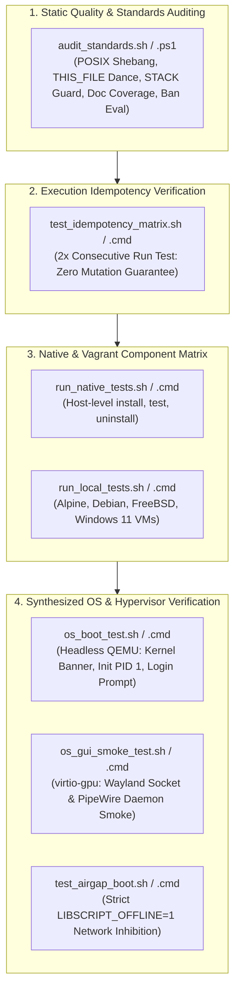

# Testing & Verification Strategy

LibScript relies on a multi-tier testing and verification matrix to guarantee cross-platform
reliability, strict POSIX/Windows parity, operating system boot health, and idempotent
reproducibility.

---

## 🏛️ Verification Architecture Overview

The testing suite validates every layer of the LibScript substrate, from static script linting to
headless operating system boot in virtualized hardware:



---

## 1. Standards Compliance & Static Audit (`audit_standards.sh`)

Every shell and batch script in the repository is audited by `devtools/audit/audit_standards.sh`
(POSIX) and `devtools/audit/audit_standards.ps1` (PowerShell) to enforce non-negotiable
architectural invariants:

```sh
# Audit a specific script
./devtools/audit/audit_standards.sh _lib/base-system/glibc/setup.sh

# Audit all scripts across a category or directory
./devtools/audit/audit_standards.sh _lib/
```

### Enforced Invariant Rules

1. **`POSIX_SHEBANG`**: Strict `#!/bin/sh` on line 1; bans non-POSIX shells (`bash`, `zsh`, `ksh`)
   and non-portable bashisms (`[[ ... ]]`, `source`, `type`).
2. **`THIS_FILE_DANCE`**: Canonical `THIS_FILE=` path resolution within the first 65 lines.
3. **`RECURSION_GUARD`**: Re-entrant `STACK` recursion guard in the first 65 lines.
4. **`WINDOWS_PARITY`**: Exact paired `.cmd` companion for every single `.sh` script.
5. **`BATCH_THIS_FILE`**: Canonical `set "THIS_FILE=%~f0"` and delayed expansion within the first 25
   lines of `.cmd` files.
6. **`IDEMPOTENCY`**: Banned unguarded `mkdir` (requires `mkdir -p` or `if not exist ... mkdir`);
   banned unguarded `ln -s` (requires `ln -sf`).
7. **`BAN_EVAL`**: Absolute ban on dynamic string evaluation (`eval` and `Invoke-Expression`).
8. **`DOC_OVERVIEW` & `DOC_USAGE`**: 100% documentation coverage with structured `## Overview` and
   `## Usage` headers in the first 30 lines.

---

## 2. End-to-End Idempotency Matrix (2x Run Test)

LibScript mandates that any synthesis pipeline, recipe, or installation script pass the **2x
Consecutive Execution Test**:

```sh
# Run idempotency verification matrix
./tests/test_idempotency_matrix.sh
```

### The 2x Verification Contract

1. **Pass 1 (Fresh Run)**: Compiles or installs the component, staging artifacts and writing atomic
   completion stamps (`.stamp.<component>`).
2. **Pass 2 (Consecutive Re-run)**: Executes against the identical workspace without modification.
3. **Assertions**:
   - Exit code must be `0`.
   - Must produce zero-op results (skipping re-download, re-compilation, or filesystem mutations).
   - Zero diff across all output files, rootfs directories, and image artifacts.

---

## 3. Headless OS Boot Verification (`os_boot_test.sh`)

Synthesized operating system disk images (`raw-img`, `qcow2`) are validated using the automated
headless QEMU boot test harness (`tests/os_boot_test.sh` and `tests/os_boot_test.cmd`):

```sh
# Execute headless QEMU boot test with a 60-second milestone timeout
./tests/os_boot_test.sh build/disk.qcow2 60

# Run a dry-run check without launching QEMU
./tests/os_boot_test.sh build/disk.qcow2 60 --dry-run
```

### Monitored Boot Milestones

1. **Kernel Initialization**: Detects early kernel boot banners (Linux `Linux version ...` or
   FreeBSD `FreeBSD ...`).
2. **Init System Startup**: Asserts PID 1 supervisor activation (systemd, OpenRC, runit, or BSD
   init).
3. **Login Prompt Milestone**: Asserts that serial console reaches a multi-user login prompt within
   the timeout window.
4. **Failure Capture**: Captures serial console logs and returns a non-zero exit code if milestones
   fail to trigger.

---

## 4. Graphical Desktop Smoke Tests (`os_gui_smoke_test.sh`)

For desktop configurations (Sway, Hyprland, KDE Plasma 6, XFCE4), LibScript runs headless graphical
smoke tests using virtualized GPU acceleration:

```sh
# Run desktop GUI smoke tests
./tests/os_gui_smoke_test.sh build/disk.qcow2
```

- Launches QEMU with `virtio-gpu-pci` and headless display (`-display none` or loopback VNC).
- **Wayland Socket Assertion**: Asserts that the Wayland compositor binds the runtime socket
  `/run/user/1000/wayland-0`.
- **Audio Subsystem Assertion**: Asserts that PipeWire and WirePlumber daemons start and initialize
  runtime pulse/ALSA sockets.

---

## 5. Air-Gapped Offline Boot Testing (`test_airgap_boot.sh`)

Validates enterprise deployment guarantees under simulated physical network disconnection:

```sh
# Run the air-gapped verification suite
./tests/test_airgap_boot.sh
```

- Exports `LIBSCRIPT_OFFLINE=1`.
- Verifies that all dependency queries read exclusively from `${LIBSCRIPT_CACHE_DIR}`.
- Validates SHA-256 integrity hashes against `offline_bundle.json`.
- Traps and fails immediately if any recipe invokes network primitives (`curl`, `wget`, `git clone`,
  `pip`).

---

## 6. Native Host Component Testing (`run_native_tests.sh`)

For high-performance, host-level component validation without virtual machine overhead:

```sh
# Test specific components natively
./tests/run_native_tests.sh sqlite curl nodejs

# Test an entire category
./tests/run_native_tests.sh --category databases

# Windows Command Prompt
call tests\run_native_tests.cmd sqlite curl
```

- Verifies OS compatibility against `manifest.json` (`os_whitelist` and `os_blacklist`).
- Runs `install`, `env`, `test`, and `uninstall` lifecycle sequences.
- Outputs status markers into `tests_tmp/`: `<component>.<os_tag>.success` or `.failure`.

---

## 7. Multi-Platform Local Hypervisor Testing (Vagrant)

For clean, hypervisor-level testing across distinct operating systems, LibScript maintains Vagrant
environments in `vagrant/`:

```sh
# Run tests across Alpine Linux 3.24
./tests/run_local_tests.sh

# Run tests for specific packages on a target OS
./tests/run_local_tests.sh --os debian-13 postgres redis

# Windows Batch
tests\run_local_tests.cmd postgres redis
```

Supported Vagrant testing boxes:

- `bento/windows-11` (Windows 11 / Server)
- `bento/alpine-3.24` (Alpine Linux)
- `bento/debian-13` (Debian Trixie)
- `bento/freebsd-15.1` (FreeBSD)
- `bento/rockylinux-10.2` (Rocky Linux)

_Box building instructions for Apple Silicon (`aarch64`) and `x86_64` hosts are documented in
[VAGRANT.md](VAGRANT.md)._

---

## 8. Multi-Platform CI Matrix & Results Reporting

The GitHub Actions workflow (`.github/workflows/multiplatform_tests.yml`) executes parallel matrix
jobs across Alpine, Debian, FreeBSD, and Windows.

Matrix test results are aggregated and updated automatically:

```sh
# Update README.md compatibility badges from test run outputs
./tests/update_results.sh

# Export structured JSON matrix results
./tests/update_results.sh --json tests_tmp/matrix_results.json
```

---

## 🔒 Remote Repository Safety Invariant

Under no circumstances may any test script, harness, build pipeline, or CI automation execute
**`git push`**. All test validations are strictly read-only with respect to remote repositories.
